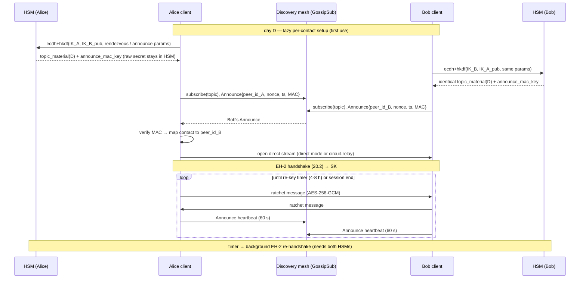
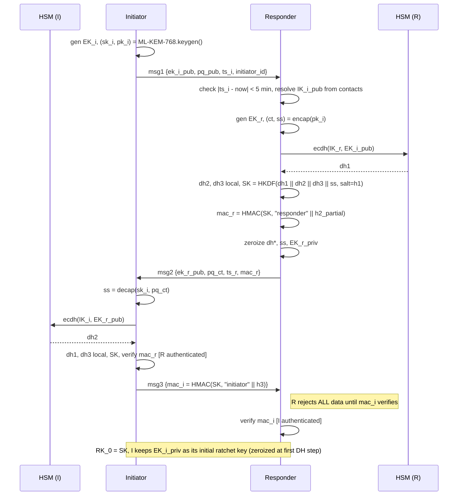
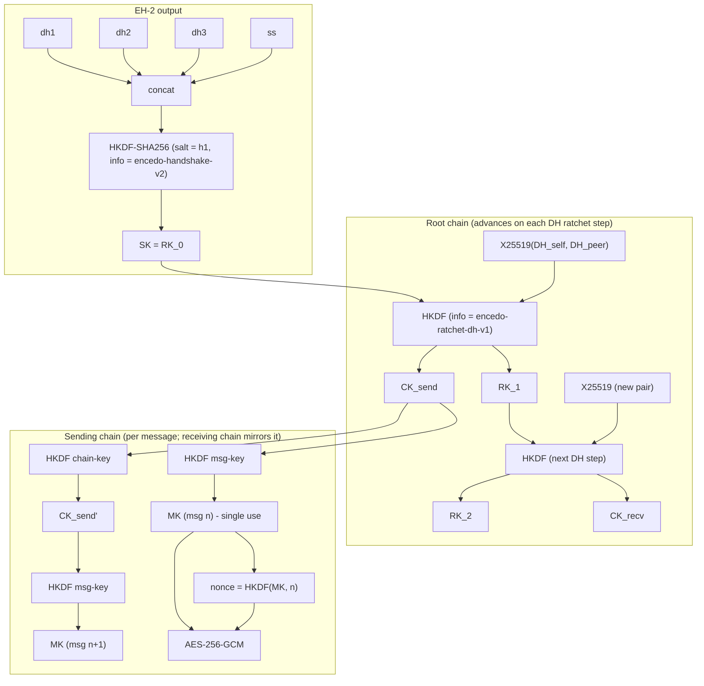
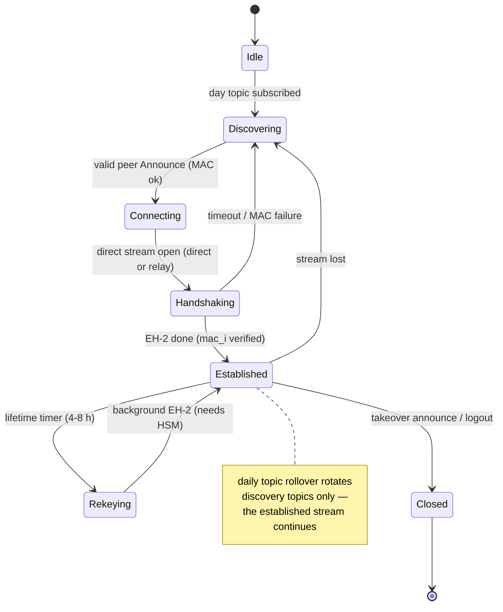
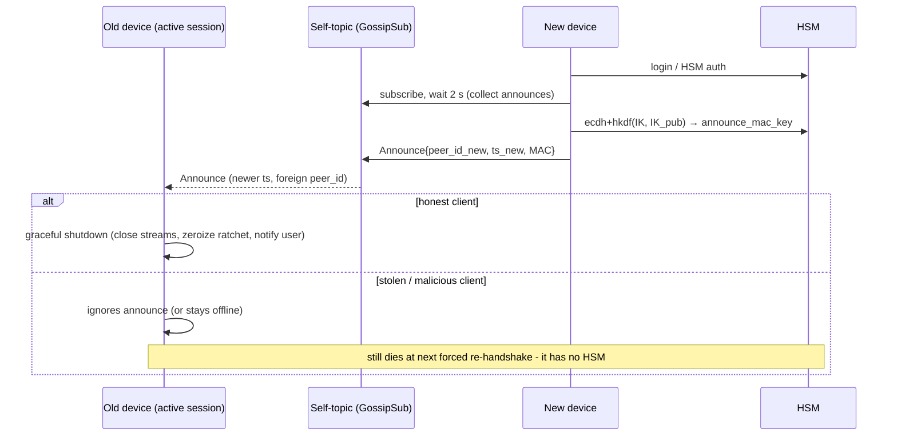
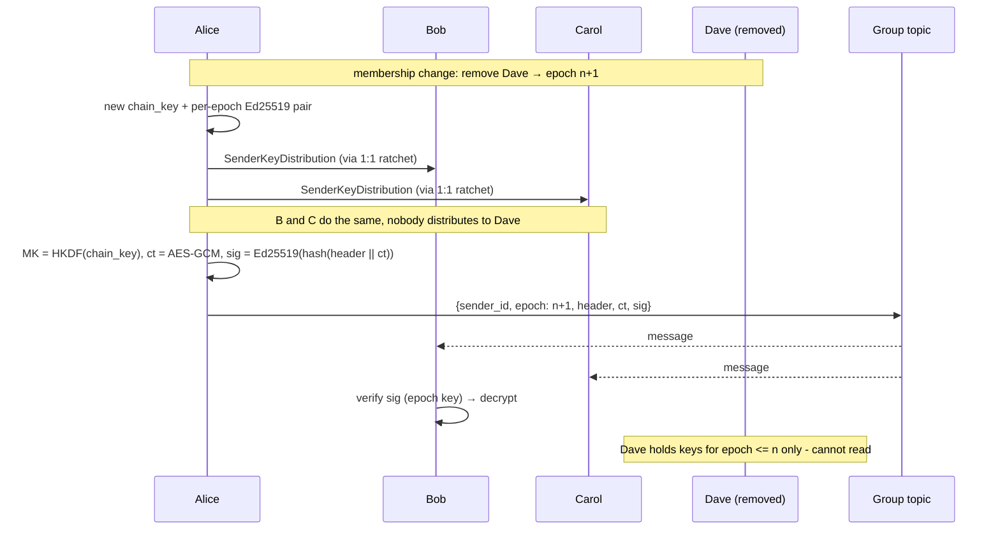

# v6 — PROTOCOL.md

Status: **normative protocol reference, draft (protocol version 1, key schedule "v2" / EH-2).**

This is the single source of truth for the chat protocol: identity, rendezvous, handshake, ratchet, groups, session management, transport, cryptographic analysis, PQ roadmap, and the implementation guide. It stands alongside `ARCHITECTURE.md` (product & infrastructure — why and where this runs) and `THREAT-MODELS.md` (deployment profiles — against whom).

The design targets a **synchronous, HSM-anchored, post-quantum-hybrid** secure messenger for private, commercial, and critical-infrastructure use. It ships in two go-to-market channels from one core: **Encedo Chat** (enterprise/tenant: EPA HSM, OIDC, DORA/NIS2 framing) and **onchato** (open public network: self-hosting, community UIs, takedown resistance).

Sections marked **[v6 extension]** are additions beyond the audited crypto design (network isolation, transport modes, group-topic derivation) and are flagged for review.

---

## 1. Summary

- **HSM-anchored identity** — the identity private key never leaves the HSM (Encedo PPA or EPA, reachable over REST/TLS 1.3). Chat's entire HSM crypto surface is a single call — `ecdh`, in two modes (raw, or with the HKDF step executed inside the HSM) — plus key management (generate / delete / search).
- **Post-quantum hybrid confidentiality from day 1** — the handshake combines classical ECDH (X25519) with a post-quantum KEM (ML-KEM-768); "harvest now, decrypt later" is defeated.
- **One identity key** — native X25519, purpose `ecdh` enforced by an HEM flag. No dual-use, no curve conversion, no dormant keys. It never signs.
- **Deniability** — authentication by MAC over the transcript, not by signature.
- **Metadata privacy** — deterministic, daily-rotated rendezvous topics; ephemeral PeerIds; no central server.
- **Synchronous model** — no store-and-forward; both parties must be online. This is what eliminates prekeys, prekey servers, and multi-device ratchet sync.
- **Single active session** per identity; switching device force-logs-out the previous one (dead man's switch).

Transport: **libp2p** (WebRTC + WebSocket Secure + GossipSub). Clients: one core in two tiers — PWA (browser, zero-install) and Tauri 2 (desktop + mobile, Rust core keeping crypto and ratchet state outside the webview).

**Conscious v1 tradeoff:** confidentiality is PQ-safe; **authentication remains classical** until Phase 3 (§15). A future active quantum MITM is the only unaddressed threat, realistic for state-level adversaries against high-value targets around 2035–2040; the in-band migration path (§15) closes it before then.

---

## 2. Goals & threat model

### 2.1 Security goals (all simultaneously)

| Goal | Meaning |
|---|---|
| Confidentiality | Message content available only to conversation participants |
| Integrity | In-transit modification is detected |
| Mutual authentication | Both sides authenticate via their long-term IK |
| Forward secrecy (FS) | IK compromise does **not** expose past sessions |
| Post-compromise security (PCS) | Ratchet-state compromise heals after some new messages |
| PQ hybrid | Confidentiality holds if **either** ECDH or ML-KEM survives |
| Deniability | After a session, neither side holds cryptographic proof the other authored a message |
| Metadata privacy | A network observer cannot determine who talks to whom from libp2p traffic alone |

### 2.2 Adversaries

**In scope:** passive network observer (sees all libp2p traffic, GossipSub topics, direct streams; cannot break TLS 1.3 or libp2p Noise); active MITM on the libp2p transport; compromise of the long-term IK (HSM theft / insider); compromise of ratchet state (device theft with live cache); compromise of individual message keys (side channel); quantum "harvest now, decrypt later".

**Out of scope:** HSM core compromise (firmware-level — assumed trusted, it is its job to protect keys); endpoint compromise (root on a running client reads plaintext at display time — no E2E protocol solves this); ISP-level statistical traffic analysis (timing/size — the protocol protects logical metadata, not statistical); coercion (organizational, not protocol); DoS by flooding rendezvous (rate-limited at the libp2p/GossipSub layer).

### 2.3 Environment assumptions

- HSM is trusted (firmware correctly implements primitives, protects private keys).
- TLS 1.3 client↔HSM negotiates the **hybrid group X25519MLKEM768** (verified in Chrome) — the transport to the HSM is itself PQ-hybrid, so no segment of the data path relies on classical crypto alone.
- Both HSM and client have a CSPRNG.
- Clocks synchronized to ±5 min of UTC (typically NTP).
- **Out-of-band contact import** establishes public-key authenticity (in-person QR, fingerprint verification, admin enrollment). The protocol does **not** solve trust establishment.

### 2.4 Simplifying assumptions and what they buy

| Assumption | Consequence |
|---|---|
| No offline messages | Eliminates prekey bundles, OPK pools, server-side prekey storage |
| Single active session per user | Eliminates multi-device ratchet synchronization |
| Contacts imported out-of-band | Eliminates key-transparency / CDS infrastructure |
| Shared sender key for groups | Eliminates pairwise handshake per message for each group member |

---

## 3. Layered architecture

```
┌───────────────────────────────────────────────────────────┐
│ UI packages (ui-*)          — replaceable skins           │
├───────────────────────────────────────────────────────────┤
│ Core API                    — commands / events / snapshot│
├───────────────────────────────────────────────────────────┤
│ Message layer               — Protobuf v1 · cache         │
├───────────────────────────────────────────────────────────┤
│ Session layer                                             │
│   EH-2 handshake · Double Ratchet · Sender Keys (groups)  │
├───────────────────────────────────────────────────────────┤
│ Identity & rendezvous (HSM-anchored)                      │
│   IK in HEM · deterministic topics · Announce ·           │
│   self-topic · single active session                      │
├───────────────────────────────────────────────────────────┤
│ Transport (two planes, two modes)                         │
│   control: GossipSub        data: direct stream /         │
│   over discovery mesh             circuit-relay-v2        │
├───────────────────────────────────────────────────────────┤
│ libp2p     rust-libp2p (Tauri tier) · js-libp2p (PWA tier)│
├───────────────────────────────────────────────────────────┤
│ HSM layer  HEM REST over TLS 1.3 (X25519MLKEM768)         │
│   ecdh (raw) · key_search · key_generate                  │
└───────────────────────────────────────────────────────────┘
```

The protocol assumes **no security property from libp2p** beyond hop-to-hop transport encryption; all guarantees come from the session layer.

### 3.1 Responsibility split

- **HSM** — key management (create/delete/search) and crypto on IK: `ecdh` raw, or `ecdh`+HKDF in one call (§4.3). **HKDF over an IK-derived secret runs inside the HSM** so the raw pair secret never reaches the client; the only exception is EH-2, where raw mode is required to concatenate the DH outputs (§6.2).
- **Client** — all ephemeral operations (EK, ML-KEM keygen/encap/decap, AEAD, ratchet) and any HKDF whose input is **not** an IK-derived secret (e.g. the ratchet chain KDFs, keyed by ratchet state that already lives in client RAM), plus session state, cache, presence.
- **libp2p** — message transport and pubsub for rendezvous only.

### 3.2 Two client tiers

- **Tauri 2 = hardened tier** (desktop Win/macOS/Linux + mobile iOS/Android): a **Rust core** runs rust-libp2p, all ephemeral crypto, ratchet state, and the HEM client **outside the webview**; the webview receives only plaintext-to-render and UI events over IPC. Webview compromise (XSS, UI-layer npm supply chain) does not reach keys or ratchet state — this mitigates S1/S5 (§11.3). Binary single-digit MB; signed auto-updates.
- **PWA = convenience tier** (zero-install, browser): js-libp2p + WebCrypto/`@noble` in the JS context. Same protocol, weaker isolation — honest tiering.
- **One `core-rs`, two targets**: the Rust core compiles natively for Tauri and to WASM for the PWA; the TS side degrades to thin glue (transport adapter, bindings). One handshake, one ratchet, one set of test vectors, one audit. Caveat: WASM in the browser shares memory with JS — XSS still reaches module state; the Tauri advantage comes from **process separation**, not compilation form.

### 3.3 No application server

There is no prekey server, directory service, or message relay. The only central points are the **HSM** (EPA, per-tenant, Encedo-provided or self-hosted) and **libp2p bootstrap/discovery nodes** (standard p2p infrastructure — see `ARCHITECTURE.md`).

---

## 4. Identity & keys

| Key | Type | Where | Lifetime | Used for |
|---|---|---|---|---|
| **IK** | X25519, purpose=`ecdh` (HEM flag) | HSM (PPA/EPA) | permanent | EH-2 DHs, topic derivation. **Never signs.** |
| **EK** | X25519 | client RAM | one handshake (initiator's EK doubles as its initial ratchet key — §6.2) | EH-2 forward secrecy |
| ML-KEM pair | ML-KEM-768 | client RAM | one handshake | PQ hybrid component |
| Ratchet state (RK/CK/MK) | symmetric | client RAM (Rust core, Tauri tier) | session | per-message keys |
| Sender key + per-epoch signing | symmetric + Ed25519 | client | group epoch | group messages |
| libp2p PeerId | Ed25519 (libp2p) | client RAM | one app start | transport only; unlinked to IK |
| Node key | libp2p keypair | node disk (`--key-file`; `--pass` derivation dev-only) | permanent | node identity, pinned in signed node list |

### 4.1 Key-per-purpose

IK does not sign anything — deniability (§6.4) excludes handshake signatures, group sender signatures use separate ephemeral keys (§8), and topics rest on ECDH only. A key declared Ed25519 (even dual-flagged) would carry a capability the protocol never uses, plus a Montgomery-conversion step per operation. HEM enforces purpose separation by hardware flag, so separation is a property of the device, not of implementation discipline. **No key sharing across products** (Chat, Mail/PGP, Vault, Identity have separate HSM keys) — removes joint-security questions from a whole-stack audit. **No dormant keys** — an unused key is not a security property.

### 4.2 DESCR (key metadata)

Format: `<namespace>:<role>:<key_type>:<principal>:<attributes>`.

```
CHAT:self:ik:krzysztof@encedo.com                          ← X25519, purpose=ecdh
CHAT:contact:ik:alice@proton.me:fp=<sha256(pub)[0:16] hex> ← imported contact pubkey
CHAT:channel:<channel-id>:member:<user-principal>
CHAT:channel:<channel-id>:sender_key:epoch=<n>
```

Contacts are stored as **public keys with metadata**, not private keys. The client verifies `SHA-256(pubkey)[0:16] == fp` on every use. Import (QR / bundle) carries one X25519 pubkey + fingerprint; the user compares one fingerprint out-of-band, not a set.

### 4.3 HSM operations

HEM provides two things: **key management** (create, delete, search keys) and **crypto on those keys** — `ecdh` in two modes: raw, or with an **HKDF step executed inside the HSM** (the secret is the ECDH output; salt, info and length are API arguments).

| Operation | Use | Frequency |
|---|---|---|
| `ecdh(kid, peer_pub, raw=true)` | **EH-2 only** — the raw shared point feeds the concatenated ikm (§6.2) | 1 call per handshake |
| `ecdh(kid, peer_pub, hkdf={salt, info, L})` | topic material (§5.1), announce MAC keys (§5.2, §5.5), cache key (§10) — HKDF runs **inside the HSM**; the raw secret never leaves it | 2–3 calls/contact/day |
| `key_generate(type=X25519, purpose=ecdh)` | IK at onboarding; contact import (public-key entries) | once/user, once/contact |
| `key_delete(kid)` | contact removal, IK rotation (§16 P6) | rare |
| `key_search(prefix)` | resolve contacts, group membership | medium |
| `key_list` | initial contact-book load | rare (client start) |
| `exdsa_sign` | **not used** — deniability requires MAC, not signature | zero |
| ML-KEM / ML-DSA in HSM | **not used in Phase 1** — ML-KEM is ephemeral & client-side; long-term PQ key only from Phase 3 (§15) | zero |

The whole Chat↔HSM boundary is **one crypto call in two modes** plus key management (`key_generate`, `key_delete`, `key_search`, `key_list`). Everything else (HMAC, AES-GCM, ML-KEM, ratchet, and HKDFs whose ikm is not an IK-derived secret) is client-side with standard libraries. **Zero firmware changes for Phase 1.**

**Mode rule:** raw mode is used **only inside EH-2**, where the shared point must be concatenated with the other DH outputs client-side (and is zeroized immediately after `SK` derivation). Every other IK-based derivation uses the HKDF mode, so **raw IK-derived secrets never sit in client memory outside a handshake** — a compromised client leaks at most the current day's derived material, never the permanent pair secret.

### 4.4 Contact integrity

Contacts are public keys (confidentiality not critical); **integrity is critical** — an attacker swapping a contact's IK_pub achieves a perfect MITM. Protection: (1) fingerprint-in-DESCR check on every use; (2) HSM authentication (OIDC token or PKI client cert) gates key modification as a privileged op; (3) out-of-band fingerprint verification at import.

---

## 5. Rendezvous & discovery

### 5.1 Pair topic

```
shared_secret  = ECDH(IK_a_priv, IK_b_pub)            // HSM call; equal on both sides
topic_material = HKDF-SHA256(
                   ikm  = shared_secret,
                   salt = "encedo-chat-rendezvous-v1",
                   info = network_id || 0x00 || date_UTC,   // [v6 extension]; audited baseline was date_UTC only
                   L    = 32)
topic          = base32(topic_material)[0:52]
```

- `date_UTC` = `YYYY-MM-DD` → 24 h rotation, bounding the metadata-correlation window.
- **[v6 extension]** `network_id` (the `--network` identifier, default `main`) is mixed in so independent networks are disjoint even if their nodes interconnect by accident. `0x00` is a domain separator against ambiguity between `network_id` and date.
- Topic is indistinguishable from random without `shared_secret`. **Circular knowledge requirement:** to map a topic to (Alice, Bob) an observer must already know both IK_pubs — i.e. already know the relationship they seek.
- Executed as **one HSM call** in the `ecdh`+HKDF mode (§4.3): the client receives the day's `topic_material` directly; the raw `shared_secret` never leaves the HSM. Computed **lazily** (first use per contact per day), not batched at midnight (see §16 P2 on rate limits).

### 5.2 Self-topic

Same construction with `ikm = IK_a_pub` (public), `salt = "encedo-chat-self-rendezvous-v1"`. Anyone knowing IK_pub can compute it — **deliberate** (documented presence leak, S2). Used for session takeover (§7). Its content is authenticated: the MAC key derives from `ECDH(IK_a_priv, IK_a_pub)` (a DH of the key with itself), computable only inside the HSM, so only the IK holder can post valid announces — obtained via the `ecdh`+HKDF mode, so only the derived MAC key reaches the client.

### 5.3 Group topic — **[v6 extension, to confirm at next revision]**

Same construction with `ikm = group_secret` (from Sender-Key distribution context), `salt = "encedo-chat-rendezvous-v1"`, same `info`. The audited design references `group_topic` without fixing derivation; this fills the gap symmetrically with the pair topic.

### 5.4 UTC rollover

- Within ±5 min of midnight UTC: subscribe `[yesterday, today, tomorrow]`; otherwise `today` only.
- Publish always on sender's `today`. Accept if timestamp within ±5 min **and** topic matches any of the three.

> **Proposal — per-pair rotation offset** *(v6, 2026-08-01; not yet normative — the fixed-midnight rollover above stands until this is accepted).*
>
> **Motivation.** The baseline rotates every pair at 00:00 UTC, so the whole user
> base re-subscribes inside one ±5 min window — a synchronised load spike on the
> discovery nodes (§5.6) — and the window must be wide enough to absorb clock skew
> between the two members. Deriving each pair's own rollover time-of-day from the
> pair secret fixes both: rotations spread ~uniformly across 24 h across the user
> base (no midnight spike), and both members derive the **identical** offset, so
> they cross together and the overlap shrinks to a skew/propagation guard.
>
> **Derivation** (date-independent, so computed once per contact and cached until
> IK rotation — same `ecdh`+HKDF-in-HSM mode as §5.1, the raw secret never leaves):
>
> ```
> rotation_material = HKDF-SHA256(
>                       ikm  = shared_secret,
>                       salt = "encedo-chat-rotation-v1",
>                       info = network_id || 0x00,          // NO date — the offset is stable per pair
>                       L    = 4)
> offset_seconds    = be32(rotation_material) mod 86400     // rollover time-of-day, seconds past 00:00 UTC
> ```
>
> The topic itself still rotates **daily** per §5.1 (`date_UTC` stays in its
> `info`); only the *instant* of rollover moves from 00:00 UTC to
> `00:00 + offset_seconds`. The offset is secret to the pair — derived from
> `shared_secret`, so not predictable without a private IK, exactly like the topic.
>
> **Rollover rule** (replaces the fixed-midnight window, for this pair):
> - The pair's topic transitions from day `D` to `D+1` at
>   `T = midnight(D+1) + offset_seconds`.
> - Within ±`guard` of `T`, subscribe **both** adjacent days' topics; otherwise the
>   current day only. Because both members share `offset_seconds` they cross
>   together, so `guard` covers only clock skew + GossipSub mesh-graft propagation
>   on the new topic — not a 24 h disagreement, and only **two** topics overlap, not
>   three. (A per-*client* jittered offset, which the members do NOT share, would
>   need a wide overlap to cover the disagreement — rejected.)
> - Publish on the sender's current-day topic under this schedule; accept if the
>   topic matches either side of the guard.
>
> **Clock synchronisation** (lets `guard` shrink from minutes to seconds).
> Members SHOULD anchor the rollover to a common clock so the guard covers only
> propagation, not device drift. Browsers cannot run NTP (no UDP), so time comes
> over HTTPS from an operator host. The cheapest source is the **`Date` response
> header**, which every HTTPS response already carries: a **same-origin** `HEAD /`
> on the web app's own host (e.g. `onchato.com`) exposes it with no endpoint and no
> server code, and its 1 s resolution sits well inside any `guard`. Caveats — the
> request must not be answered from a cache (use a dynamic/no-store path); a
> *cross-origin* host must add `Access-Control-Expose-Headers: Date` for JS to read
> it; and the WebSocket-upgrade response's own headers are **not** exposed to JS, so
> this is a separate cheap request, not a free read off the relay socket. A
> dedicated `GET /now` → epoch-ms is warranted only for sub-second precision, which
> rollover does not need. The client computes `skew = server_time − (t_send +
> t_recv)/2` (SNTP-style RTT correction), caches it, uses `local_clock + skew`, and
> re-syncs ~hourly / on reconnect — not per message. The time source is a **soft hint, not a trust anchor**: a discovery
> node is already trusted only for availability (threat model), so a false clock is
> a denial-of-service (desync) it could already cause by dropping traffic, and it
> never learns `offset_seconds` (secret) from serving a global clock. Clients clamp
> the correction (reject/alert if it disagrees with the local clock by more than a
> few minutes) and fall back to the local clock (wider guard) if the time fetch
> is unavailable; native clients MAY use the OS clock instead.
>
> **Compatibility.** Two implementations MUST agree on the schedule: a client
> applying the offset and one still on fixed-midnight would miss each other for up
> to `offset_seconds`. Hence this is gated behind the amendment, not a unilateral
> client change; the interim client-side behaviour is the baseline ±5 min midnight
> window.

### 5.5 Announce (presence)

Published on every active topic (contact topics + self-topic) at session start, every 60 s (heartbeat), and at rollover. This is also the room-presence signal ("is Y in the park yet").

```
Announce { version=1, peer_id (~38 B), nonce (16 B), timestamp (unix ms), mac }

announce_mac_key = HKDF-SHA256(ikm  = shared_secret,    // or the self-DH value for self-topic
                               salt = "encedo-chat-announce-mac-v1",
                               info = network_id || 0x00 || date_UTC,   // [v6 extension] — uniform with §5.1
                               L    = 32)
mac = HMAC-SHA256(announce_mac_key, version || peer_id || nonce || timestamp)
```

`announce_mac_key` is obtained via the `ecdh`+HKDF mode (§4.3) — one HSM call per contact per day; the raw pair secret stays in the HSM.

Receiver: check version; timestamp ±5 min (replay); `(peer_id, nonce, timestamp)` unseen today (duplicate); MAC constant-time. On success update `contact → peer_id`. The PeerId↔user mapping exists **only** inside this MAC'd channel; IK_pub never appears on the wire.

### 5.6 Discovery nodes (transport infrastructure)

3–5 operator-run libp2p nodes: GossipSub mesh (flood + seen-cache dedup between nodes) + circuit-relay-v2, behind nginx (WSS/443). `--network` isolation, keys on disk, PeerIds pinned in the operator-signed node list, **topic TTL eviction** instead of a hard cap (per-pair daily topics → many short-lived topics). Node selection: dial 2–3 nearest from the signed list in parallel, keep the fastest. Full node-operations detail in `ARCHITECTURE.md`.

---

## 6. Handshake — EH-2

Interactive, Noise-XX-flavored with an ephemeral ML-KEM extension. **1.5 round-trips** (msg1 → msg2 → msg3_confirm), over a direct stream opened after discovery. Produces `SK` (32 B) = `RK_0`.

### 6.1 Messages

```
I → R  msg1 { version, ek_i_pub, pq_pub (ML-KEM-768), timestamp, initiator_id = SHA-256(IK_i_pub)[0:8] }
R → I  msg2 { version, ek_r_pub, pq_ct, timestamp, mac_r }
I → R  msg3 { version, mac_i }
```

`initiator_id` is a non-security hint for R to resolve IK_i_pub from its contact book.

### 6.2 Key schedule

```
h1  = SHA-256(serialize(msg1))
ss  = ML-KEM-768 encapsulate (R) / decapsulate (I)
ikm = DH(IK_r, EK_i) || DH(EK_r, IK_i) || DH(EK_r, EK_i) || ss
SK  = HKDF-SHA256(ikm, salt = h1, info = "encedo-handshake-v2", L = 32)

h2_partial = SHA-256(serialize(msg1) || EK_r_pub || ct || ts_r)
mac_r = HMAC-SHA256(SK, "responder" || h2_partial)      // R authenticates to I (in msg2)
h3    = SHA-256(h2_partial || mac_r)
mac_i = HMAC-SHA256(SK, "initiator" || h3)               // I authenticates to R (in msg3)
```

Each side makes exactly **one HSM ECDH call** (the DH involving its own IK; raw mode — this is the only place raw mode is used, §4.3); the other two DHs are local. DH outputs, `ss`, `sk_i` and R's `EK_r_priv` are zeroized as soon as `SK` is derived. **Exception — `EK_i_priv` lives longer:** R seeds the ratchet's first `DH_peer_pub` with `EK_i_pub` from msg1 (saves one round), so I keeps `EK_i_priv` as its initial ratchet private key until the first DH-ratchet step replaces it; it is zeroized then, not at handshake end.

Two rules the wire flow implies but implementers miss:

- **msg3 gates the responder.** I holds `SK` after msg2 and may transmit immediately after msg3; **R MUST NOT accept any application/ratchet message from I until `mac_i` (msg3) verifies** — before that moment I is unauthenticated.
- **`pq_ct` binding.** The ML-KEM ciphertext does not enter SK derivation directly (only `ss` does); it is authenticated via `h2_partial` inside both MACs, and FIPS 203 binds (pk, ct) → ss internally.

### 6.3 DH ordering (critical for correctness)

Both sides concatenate DH outputs in **responder perspective**:

```
ikm = DH(IK_r, EK_i) || DH(EK_r, IK_i) || DH(EK_r, EK_i) || ss
```

The initiator computes the same values from the other side via X25519 commutativity (`DH(EK_i, IK_r) == DH(IK_r, EK_i)`). **This mismatch is the single most common "SK doesn't match" bug — write it as the first test.**

### 6.4 Analysis

- **Mutual authentication.** R authenticates I via msg3: only the holder of `IK_i_priv` can compute `DH(IK_i, EK_r)` → derive `SK` → produce `mac_i`. I authenticates R via msg2 symmetrically on `DH(IK_r, EK_i)`.
- **Forward secrecy.** Compromising `IK_*_priv` after the session does not recover `SK` — the zeroized ephemerals `EK_*`, `sk_i` are also required.
- **PQ hybrid.** `SK = f(dh1 || dh2 || dh3 || ss)`; `dh*` rest on ECDLP (classical), `ss` on MLWE (ML-KEM-768, PQ). Breaking one problem is insufficient: `SK` confidentiality holds while **either** assumption stands. Concatenation-in-HKDF is the standard hybrid combiner (draft-ietf-tls-hybrid-design; Bindel et al. 2019). Framing for the auditor: EH-2 is an **AKE** (MAC-authenticated, Noise-style) whose classical component is a NIKE (X25519), not a CCA-secure KEM — the security argument lives at the AKE level, not as "two IND-CCA2 KEMs combined".
- **Deniability.** No long-term-key signatures. Both MACs use `SK`, shared by both parties — either could have produced any MAC on `SK` post hoc, so neither holds proof of authorship (offline/non-repudiation deniability). Online real-time deniability would need ZK proofs (not used; unnecessary for the target).
- **KCI resistance.** An attacker with `IK_r_priv` still cannot impersonate someone else *to* R: forging `mac_i` needs `SK`, needing `dh2 = DH(IK_i_priv, EK_r_pub)`, needing `IK_i_priv`.
- **Replay protection.** (1) timestamps ±5 min; (2) `h1 = SHA-256(msg1)` salts `SK`, so every session's `SK` differs; (3) per-topic-per-day nonce cache.

---

## 7. Messaging — Double Ratchet

Signal-style; `RK_0 = SK`.

### 7.1 State (per conversation)

```
DR_State { RK, CK_send, CK_recv, DH_self_priv, DH_self_pub, DH_peer_pub,
           N_send, N_recv, PN, skipped_keys: map<(DH_pub, N), MK> }
```

### 7.2 Steps

```
DH step:        RK', CK = HKDF-SHA256(ikm = X25519(DH_self, DH_peer), salt = RK,
                                      info = "encedo-ratchet-dh-v1", L = 64)
Message key:    MK       = HKDF-SHA256(CK, info = "encedo-msg-key",   L = 32)
Chain advance:  CK'      = HKDF-SHA256(CK, info = "encedo-chain-key", L = 32)
Nonce:          12 B     = HKDF-SHA256(MK, info = "encedo-aead-nonce" || N_bytes, L = 12)
AEAD:           AES-256-GCM(MK, nonce, plaintext, aad = header)
Header:         { dh_pub, pn, n }
```

Nonce via HKDF (not a bare counter) for defensive robustness against implementation nonce-reuse bugs; collisions are mathematically impossible across distinct MKs.

### 7.3 Rules

- MK is single-use, zeroized after use; a state snapshot after message *n* cannot decrypt messages < *n* (per-message FS).
- **Skipped-key bounds** (DoS protection against "future" DH publics): max 1000 per chain, 5 chains back, 24 h TTL.
- **Bounded session lifetime** (S10 mitigation): forced background re-handshake every **4–8 h** (policy-configurable), transparent to the UI → hard upper bound on classical-PCS exposure. Reconnects and device switches also force a fresh EH-2 with new ML-KEM material; note that the daily topic rollover by itself does **not** break an established stream — the guaranteed cadence comes from the lifetime timer. Either way, PQ re-key is measured in hours, not months. The timer has a second, independent job: it is the hard bound on how long a hijacked live session can survive without the HSM (§9.3).
- Message content travels **only** on the data plane (direct/relay stream) — never GossipSub.
- Serialization: Protobuf v1 (`proto/` is the wire-format source of truth).

---

## 8. Groups — Sender Keys

Scale assumption: **3–5 members, max 8–10** (1:1 goes through §6–7, not the group mechanism). MLS (RFC 9420) deferred, not rejected — its O(log N) advantage matters above ~50 members; at this scale the pairwise redistribution cost on membership change is ~9 messages, negligible.

- Per group per member: `{ chain_key, per-epoch Ed25519 signing pair, epoch }`.
- **Distribution:** `SenderKeyDistribution { group_id, epoch, chain_key, signing_pub }` sent pairwise through existing EH-2/ratchet sessions.
- **Send:** `MK = HKDF(chain_key, info="encedo-group-msg")`; advance via `"encedo-group-chain"`; `ct = AES-256-GCM(MK, ...)`; `sig = Ed25519(hash(header || ct))`; broadcast `{ sender_id = SHA-256(IK_pub)[0:8], epoch, header, ct, sig }` on the group topic.
- **Membership change:** every remaining member increments epoch, regenerates its sender key, and redistributes — on *add*, including the newcomer; on *remove*, excluding the removed (who then cannot read post-removal messages).
- Signatures use **ephemeral per-epoch keys**, not IK — insider-forgery protection (member A cannot forge a message as B), at the cost of reduced in-group deniability (accepted, S3).
- **Property note (vs 1:1):** the group chain gives forward secrecy within a chain (hash-ratchet forward) but **no post-compromise security inside an epoch** — a compromised `chain_key` reads all of that sender's group traffic until the next membership change / epoch rotation re-keys it. The 1:1 DH-ratchet self-healing has no group counterpart here (that is MLS territory — deferred, §11.4).

---

## 9. Session management

**Single active session per identity.**

### 9.1 Takeover via self-topic

Bootstrap: generate `peer_id`, subscribe self-topic, wait 2 s collecting historical announces, verify each MAC, then publish own announce. During operation, on a valid self-topic announce with `peer_id != mine`: if its timestamp is **newer** than my session start → graceful shutdown; if equal → tie-break, higher `peer_id` wins.

### 9.2 Graceful shutdown

Close all direct streams; unsubscribe all topics; clear ratchet state from RAM; clear decrypted messages from UI (encrypted disk cache stays if enabled); notify "session moved"; optionally quit / return to login.

### 9.3 Dead man's switch (device theft)

What an attacker holding the device but **not** the HSM can and cannot do:

- **Cannot:** start any new EH-2 (with anyone), compute the next day's rendezvous topics, or post valid announces — each of these needs `ecdh(IK, ·)` inside the HSM.
- **Can:** keep reading an **already-open, unlocked session** — the Double Ratchet runs on ephemeral keys in client RAM (§7.1) and does not touch the HSM. This is the same exposure as any stolen unlocked messenger.
- **Hard stop:** the **bounded session lifetime** (§7.3). The next forced re-handshake (≤ 4–8 h) requires the HSM the attacker does not have — the hijacked session dies at the timer, guaranteed. This is the actual security boundary of the stolen-device scenario, and the second job of the lifetime timer beyond PCS.

Self-topic takeover is a **coordination mechanism for honest clients, not a security control**: a malicious client simply ignores `graceful_shutdown`, or cuts the network so it never sees the announce. Ignoring it buys nothing beyond the timer bound above — an isolated client receives no new messages, and a connected one still dies at the next re-handshake. An attacker **with** a live HSM token extends the window only until that token expires or is revoked.

### 9.4 Ratchet-state portability — Option C

Ratchet state is **not** carried between devices. A device switch requires a fresh EH-2 per contact ("establishing sessions…"); history is per-device. Rationale: drastic protocol simplification, alignment with the synchronous model, a PFS bonus (every switch forces fresh DH), and a clean mental model ("my device = my account", iMessage-handoff style).

---

## 10. Local persistence (cache)

The network stores **nothing**, ever — no store-and-forward, no server-side history. Local, device-only cache is a per-profile default:

| Profile | Default | Notes |
|---|---|---|
| P1 | **Encrypted cache** — key via HSM ECDH, HSM-unlockable | stolen disk without HSM = unreadable; user may switch to ephemeral |
| P2 | **Ephemeral** (RAM only) | user may opt into encrypted cache |
| P3 | **Ephemeral, enforced by policy** | no persistence option exposed |

```
cache_master_key     = ECDH(IK_priv, device_bound_public_salt)             // HSM call — the user's IK
cache_encryption_key = HKDF-SHA256(cache_master_key, salt = device_id,
                                   info = "encedo-chat-cache-v1", L = 32)
```

`device_bound_public_salt` is a random 32 B value generated at first run and stored locally; X25519 consumes it as if it were a public key. This is a deliberate **"KDF through the HSM"** construction, executed as a single `ecdh`+HKDF call (§4.3): deriving the cache key requires the HSM (which holds IK) *plus* this device-local value, and `cache_master_key` **never materializes outside the HSM** — the client receives only `cache_encryption_key`. X25519 accepts arbitrary 32-byte inputs safely (RFC 7748 clamping; the output feeds HKDF, so contributory-behaviour caveats do not apply). Per-device separation comes from the random salt and `device_id` in HKDF. Cache (and persisted ratchet state, if enabled) unlocks **only** through the user's HSM. Logout deletes the salt and all cached data.

---

## 11. Cryptographic properties & security analysis

### 11.1 Primitives

| Primitive | Algorithm | Standard |
|---|---|---|
| ECDH | X25519 | RFC 7748 |
| Signatures (groups only, ephemeral per-epoch) | Ed25519 | RFC 8032 |
| PQ KEM | ML-KEM-768 (NIST Level 3) | FIPS 203 |
| Hash | SHA-256 | FIPS 180-4 |
| KDF | HKDF-SHA256 | RFC 5869 |
| MAC | HMAC-SHA256 | RFC 2104 |
| AEAD | AES-256-GCM (96-bit nonce, 128-bit tag) | NIST SP 800-38D |
| Random | CSPRNG (WebCrypto / `getrandom`) | — |

### 11.2 Claims

- **Confidentiality (classical):** ECDLP hardness (X25519) + AES-256-GCM IND-CCA2.
- **Confidentiality (quantum):** MLWE hardness (ML-KEM-768); AES-256 with 128-bit Grover security = Level 3.
- **Integrity/auth:** HMAC-SHA256 UF-CMA + GCM tag.
- **FS:** ephemeral EK both sides → IK compromise cannot recover SK. **PCS:** ratchet DH steps self-heal.
- **Hybrid:** `SK` confidentiality holds while at least one of {ECDLP (X25519), MLWE (ML-KEM-768)} is hard; argued at the AKE level (§6.4).

### 11.3 Weakness register (for the auditor)

- **S1 — EK not in HSM.** Client compromise *during* handshake exposes EK_priv; with an HSM token this can reveal SK. Mitigation: narrow window, HSM session lock, and (Tauri tier) EK lives in the Rust process, not the webview.
- **S2 — self-topic is publicly computable.** An observer with IK_pub confirms a user's session is active (presence leak; cannot read/forge content). Acceptable for enterprise; weigh for the open channel.
- **S3 — no deniability in groups.** Sender signatures give non-repudiation in-group. Accepted.
- **S4 — GossipSub subscription timing.** An observer with GossipSub logs sees who subscribes which topics; correlating to a pairing still needs both IK_pubs. Mitigation: daily rotation, ephemeral PeerId.
- **S5 — ML-KEM encap client-side.** `sk_i` in client RAM; client compromise during handshake + message capture reveals `ss`. Active-attacker + endpoint-compromise only; (Tauri tier) in the Rust process.
- **S6 — [WITHDRAWN in v1.3].** "IK reuse for X25519 and Ed25519" does not occur: IK is native X25519, purpose `ecdh`, no conversion, no signing capability, not shared across products. Numbering kept for cross-reference stability.
- **S7 — nonce via HKDF.** Non-standard vs a GCM counter; auditor should confirm no collision edge case (impossible across distinct MKs, but review).
- **S8 — ±5 min replay window.** Needs NTP; skew can DoS legitimate messages or widen replay. A UX↔security compromise.
- **S9 — classical authentication in Phase 1 (the PQ gap).** Confidentiality is PQ-safe; authentication is classical X25519. "Harvest now, decrypt later" is fully covered (ML-KEM protects `ss`, a required SK component even if all DHs break). "Future active MITM" (CRQC, est. 2035–2040) is realistic only for state-level adversaries vs high-value targets. "Retrospective impersonation proof" is impossible even with a broken IK (no long-term signatures; deniability holds). Mitigation: Phase 3 in-band migration (§15) — done **before** CRQC exists (target 2030 vs 2035+). Why not now: PQ signatures (ML-DSA, standardized Aug 2024) are far less audited than classical curves; an identity certificate adds classical attack surface (parser, chain validation, revocation) — a real CVE risk today against a decade-away threat; the Phase 3 construction should be chosen at a mature standardization state.
- **S10 — in-session PCS is classical, bounded by session lifetime.** The hybrid PQ protects SK derivation, but ratchet DH steps (§7.2) use X25519 only. An adversary with both a ratchet snapshot **and** a CRQC could track subsequent steps within one continuous session. The window is narrow here because the product forces frequent full re-key (no store-and-forward, non-portable ratchet, single-session takeover, and above all the lifetime timer — every such re-key is a fresh EH-2 with ML-KEM). **Phase 1 mitigation:** the bounded session lifetime (§7.3) turns this from emergent into guaranteed. **Optional Phase 2.5:** a hybrid ratchet injecting periodic ML-KEM into DH steps — simple here (reliable ordered stream, PQ key fits one header; no SPQR-style chunking/FEC needed).

### 11.4 Considered and rejected

| Alternative | Why rejected |
|---|---|
| Full PQXDH (Signal) | Needs prekey bundles for asynchrony; overkill for a synchronous model |
| Noise XX without PQ | No PQ hybrid — fails DORA/NIS2 PQ-readiness |
| Pairwise PQXDH for groups | O(N²) handshakes; Sender Keys are standard |
| KEM combiner (XOR) vs concatenation | No stronger guarantee here than concat-KDF; adds complexity |
| Ratchet state in HSM | Every message = an HSM call; impractical latency |
| Session mgmt via HSM tokens | Needs HEM changes; rendezvous-based is simpler |
| Multi-device shared state | Needs ratchet sync + central coordinator — impractical serverless |
| Full PQ auth (ML-DSA cert) in v1 | Adds classical attack surface for a decade-away threat → Phase 3 in-band (§15) |
| Dormant ML-DSA provisioned day 1 | An unused key is not a security property; in-band migration suffices |
| IK as Ed25519 + X25519 conversion | IK never signs → the capability is dead and Montgomery conversion is a needless audit step; native X25519 + HEM flag gives the same protocol without this class of questions |
| SPQR (Signal) as PQ-ratchet template | SPQR's complexity (ML-KEM ciphertext chunking, FEC, fragment state machine) stems from asynchrony and push-size limits we don't have; a reliable ordered stream makes a simple hybrid ratchet equivalent |
| MLS (RFC 9420) for groups — **deferred, not rejected** | At 3–5 (max 8–10) members TreeKEM's O(log N) is irrelevant and the cost (Delivery Service, TreeKEM complexity) is high. Documented migration path if large groups appear |
| Electron + Cordova | Replaced by Tauri 2 (§3.2): one framework desktop+mobile, Rust core outside webview, smaller CVE surface, Cordova in maintenance |
| Iroh instead of libp2p | libp2p already integrated; no migration justification. Iroh noted as ecosystem awareness |

---

## 12. Metadata & privacy analysis

**Passive observer sees:** libp2p packets with ephemeral peer_ids; GossipSub subscriptions (pseudorandom 52-char strings); Announce contents (structured but MAC'd — sender unknown without `shared_secret`); direct streams (libp2p-Noise encrypted); TLS to the HSM. **Does not see:** user identities (IK_pub is off-wire except inside MACs verifiable only by the shared-secret holder); conversation pairs (topic→pair needs both IK_pubs); message content; who-talks-to-whom at the application layer.

**Active MITM (libp2p) can:** delay, drop, inject (rejected by MAC/signature), attempt replay (rejected by timestamp/nonce). **Cannot:** decrypt, break the handshake, or impersonate (needs IK_priv in the HSM).

**Compromised EPA (insider) can:** see all `ecdh` queries and results; run `ecdh(IK_a, peer_pub)` — but recovers only one of three DHs, never the full SK, and cannot decrypt; can log usage patterns (when Alice does ECDH, against which peer_pub → contact identification via DESCR). Mitigation: EPA audit logs visible to tenant admin, multi-operator controls for privileged ops, encrypted-DESCR storage (post-MVP).

**Harvest-now-decrypt-later:** to decrypt recorded traffic in 2040 an attacker must break **both** X25519 (quantum DLP) **and** ML-KEM-768 (MLWE). A quantum-DLP-only attacker fails. The HSM transport is likewise PQ-hybrid (X25519MLKEM768), so no segment is classically-only — the core NIS2/DORA argument for long-lived secrets.

---

## 13. Transport mapping (v6 layer)

| Plane | Carries | Mechanism |
|---|---|---|
| Control | rendezvous subscriptions, Announce, self-topic, WebRTC signaling | GossipSub over the discovery-node mesh |
| Data | EH-2 + ratchet + group messages | direct stream (rust-libp2p: TCP/QUIC/WebRTC · js-libp2p: WebRTC/WSS); fallback **circuit-relay-v2 stream** through one node |

- **Two modes** (profile-bound): *direct* (P2P preferred; peers see each other's IPs) and *relay-only* ("anonymous": never dial direct; a blind relay forwards opaque NOISE bytes; Tor/VPN-compatible since the TCP/WSS path traverses Tor while WebRTC/UDP does not). The session layer is transport-agnostic — modes are invisible to EH-2/ratchet.
- The rule "GossipSub carries rendezvous only, never content" equals the crypto design's rule. Relay data-path limits are raised on our nodes (circuit-relay-v2 defaults ~2 min/128 KB are signaling-sized).
- Full node operations, distribution, signing, and UI modularity: `ARCHITECTURE.md`.

---

## 14. Constants

| Constant | Value |
|---|---|
| HKDF labels | `encedo-chat-rendezvous-v1`, `encedo-chat-self-rendezvous-v1`, `encedo-chat-announce-mac-v1`, `encedo-handshake-v2`, `encedo-ratchet-dh-v1`, `encedo-msg-key`, `encedo-chain-key`, `encedo-aead-nonce`, `encedo-group-msg`, `encedo-group-chain`, `encedo-chat-cache-v1` |
| Topic | base32, 52 chars |
| Clock tolerance / replay window | ±5 min (NTP assumed) |
| Rollover window | ±5 min around 00:00 UTC, triple-subscribe |
| Announce heartbeat | 60 s |
| Takeover bootstrap wait | 2 s |
| Skipped keys | 1000/chain, 5 chains, 24 h |
| Session lifetime | 4–8 h, then forced re-handshake |
| Group scale | 3–5 typical, 8–10 max |

No custom primitives anywhere. Frozen library choices in §17.4.

---

## 15. Post-quantum migration roadmap

Two distinct problems on different horizons: **PQ confidentiality** (needed *now* — harvest-now-decrypt-later) and **PQ authentication** (needed before a CRQC exists, est. 2035–2040).

- **Phase 1 (2026, now).** Hybrid KEM (X25519 + ML-KEM-768) in the handshake; bounded session lifetime forcing regular PQ re-key; TLS 1.3 to HEM in X25519MLKEM768. ✅ confidentiality PQ-safe, FS, classical mutual auth, deniability. ⚠️ authentication not PQ-safe (S9).
- **Phase 2 (2027–2028).** PQ-identity infrastructure without breaking changes: identity-binding certificate spec, in-band cert distribution over rendezvous, CRL, dual-stack (v1+v2 with version negotiation). An HSM PQ identity key (ML-DSA-65 or long-term ML-KEM-768) is bound to the existing IK and distributed over the still-classically-authenticated channel — no repeat out-of-band verification.
- **Phase 2.5 (conditional, 2028–2029).** Optional hybrid ratchet (periodic ML-KEM into DH steps) for PQ-PCS inside one long session. Not a prerequisite — Phase 1's bounded lifetime already delivers the base guarantee.
- **Phase 3 (target 2030, aligned with the EU PQC roadmap — critical use-cases by 2030).** Full PQ handshake. **Recommended: long-term ML-KEM in HSM** — the handshake gains a fourth input `decap(IK_kem_priv, ct)` alongside the three DHs; authentication works by the *same* mechanism as today (only the private-key holder derives the right SK), so **no new protocol artifacts, deniability naturally preserved**. Alternative: an ML-DSA identity certificate (well-understood PKI, but adds parser/revocation surface). Decision deferred to ~2028. Version negotiation with a documented v1 deprecation window.
- **Accelerated path.** In-band migration + dual-stack + a version field let Phase 2/3 activate in months if a quantum breakthrough or regulatory mandate demands it.

**External positioning — honest, no over-claiming.** Correct: "PQ confidentiality via hybrid KEM from day 1 on both data-path segments; long-term identity stays classical; migration to PQ authentication over an authenticated channel before a CRQC exists." Wrong: "fully post-quantum from day 1." Auditors, enterprise security teams, and regulators (ENISA) all check this alignment.

---

## 16. Known limitations & open questions

**Limitations (by design):** no offline messages; no message-history portability across devices; out-of-band trust establishment (no built-in key transparency); NTP dependency (±5 min); single active session (no simultaneous laptop+phone).

**Open questions before/near implementation:**

- **P1** — OIDC integration for HSM auth vs a separate mechanism (affects bootstrap).
- **P2** — EPA rate limits: ECDH/sec per user; lazy topic computation (first use) spreads the midnight-rollover burst — confirm sizing. With the HKDF mode, per-day derivations are 2–3 calls per contact (topic + announce MAC; self MAC once); if this bites at scale, consider a batched multi-derivation variant of the API.
- **P3** — serialization format (Protobuf vs CBOR vs custom) — wire-format stability.
- **P4** — GossipSub flooding DoS: confirm score-based mesh pruning suffices at target scale; per-IP rate limiting can be added at nginx.
- **P5** — device enrollment flow (how a user authorizes a new device to use its IK: OIDC, TOTP, push to primary).
- **P6** — IK rotation on HSM compromise: no built-in contact notification; needs out-of-band re-import (MVP-acceptable, v2 feature).
- **P7** — crypto library audit (esp. `@noble/post-quantum` ML-KEM quality).
- **P8** — cache backend: IndexedDB (PWA) vs SQLite via Rust core (Tauri); different disk-encryption control (reinforces Tauri as hardened tier).
- **[v6]** — fold `network_id` (§5.1, §5.5) and the group-topic derivation (§5.3) into the normative key schedule at the next revision.
- **[v6]** — identity backend for the open channel's P1: the design assumes IK in an HSM (PPA/EPA); a zero-hardware onboarding path (software keystore, reduced assurance) is a product decision for onchato (`ARCHITECTURE.md` open item 8).

---

## 17. Implementation guide

**Overriding rule: do not invent cryptography.** Every primitive comes from a standard, audited library. Implementation is composition, not algorithm design.

### 17.1 Repository (monorepo)

```
encedo-chat/
├── proto/          handshake.proto · message.proto · announce.proto · group.proto   (wire-format truth)
├── core-rs/        crypto/ · handshake/ · ratchet/ · rendezvous/ · transport/ · hem/ · session/
├── core-ts/        thin glue for the PWA (js-libp2p adapter, WASM bindings) — NO protocol logic
├── ui/             Web Components (shared PWA + Tauri webview)
├── tauri/          Tauri 2 shell (desktop + mobile), IPC bridge
└── tests/          vectors/ (handshake KAT, ratchet KAT) · interop/ (PWA↔Tauri)
```

**One `core-rs`, two targets** (native for Tauri, WASM for PWA). Rationale is correctness, not security: two independent implementations inevitably diverge on edge cases (DH ordering, skipped keys, UTC rollover), and crypto divergence is costly to detect. **Transport must sit behind a trait** (rust-libp2p doesn't compile cleanly to browser transports → PWA keeps js-libp2p); never weave `rust-libp2p` into the handshake or ratchet. The crypto layer should be `no_std`-friendly to keep the WASM target cheap.

### 17.2 Order of work (each step ends in a verifiable assert)

- **Step 0 — skeleton.** Start with one `core-rs` + a Node binding for PoC; don't build two cores before the protocol works once. Define all of `proto/` (freeze wire format before logic). Stub `tests/vectors/`.
- **Step 1 — HEM client (blocks everything).** Implement `ecdh` (**both modes**: raw and hkdf), `key_search`, `key_generate`, `key_delete`. Integration test against a real HEM: generate X25519 purpose=`ecdh`; raw ECDH both ways, assert commutativity `ECDH(a,B)==ECDH(b,A)`; assert raw mode returns the raw point (no hidden KDF); assert **hkdf mode equals a local reference HKDF over the raw output** (same salt/info/L); assert the purpose flag rejects a signing attempt; assert `key_delete` removes resolvability via `key_search`; assert TLS negotiates X25519MLKEM768.
- **Step 2 — EH-2 (in-process, no network).** Initiator+responder state machines in one process. Primitives: `x25519-dalek`, `ml-kem`, HKDF-SHA256, HMAC-SHA256. **Assert `SK_i == SK_r`**; assert MAC verify (positive + negative); record a fixed-seed KAT. Watch §6.3 DH ordering — the usual "SK mismatch" source.
- **Step 3 — Double Ratchet (in-process).** Symmetric + DH ratchet, `RK_0 = SK`. Test 100 messages each way; FS test (snapshot after *n* can't read < *n*); out-of-order with skipped-key bounds. Ratchet KAT. **Do not implement Phase 2.5 PQ ratchet now.**
- **Step 4 — rendezvous + presence (mock transport).** Topic derivation (lazy), self-topic, Announce + MAC + verify. Test: two clients derive an identical topic, a third (foreign IK) differs; UTC rollover triple-subscribe; replay/duplicate rejection.
- **Step 5 — libp2p integration (two processes).** GossipSub for rendezvous, direct stream for content. Discovery → MAC verify → stream → EH-2 → ratchet. **Never push DM content over GossipSub.** End-to-end conversation across the network.
- **Step 6 — single session + self-topic takeover.** Publish/monitor self-topic; graceful shutdown on a newer announce; tie-break timestamp then peer_id. Test A-active/B-starts → A shuts down; dead-man's-switch simulation.
- **Step 7 — Sender Keys (groups 3–5).** Pairwise distribution over EH-2; send/receive; epoch rotation on add/remove; Ed25519 sender signature (negative forge test). Scale test at 8 members.
- **Step 7b — bounded session lifetime.** Configurable max lifetime (4–8 h); background re-handshake; assert post-re-key SK differs and pre-re-key messages don't decrypt with new state. The base classical-PCS mitigation — not deferred to Phase 2.5.
- **Step 8 — cache.** Key from `HEM.ecdh(device_key, device_salt)` → HKDF; restart→unlock→continue ratchet; security test: cache without HEM = unreadable.
- **Step 9 — UI (Web Components) + integration.** Components §17.5; connect to core via IPC (Tauri) or directly (PWA). Existing HTML mockups are the visual reference, not the code base.
- **Step 10 — Tauri 2 shell + IPC.** Rust core behind IPC; webview gets only plaintext + events. **Ephemeral keys and ratchet state NEVER cross IPC to the webview.** Mobile after desktop is green.

### 17.3 Module contracts (boundaries not to cross)

| Module | In | Out | Does NOT |
|---|---|---|---|
| `hem/` | kid, peer_pub | raw ECDH bytes | derive session keys; know ratchet |
| `handshake/` | contact IK, transport | SK (32 B) | manage sessions; touch libp2p directly |
| `ratchet/` | SK, DH inputs | MK per message | know identity; do I/O |
| `rendezvous/` | IK pair, date | topic, announce | encrypt content |
| `transport/` | topic, peer_id | bytes | know message crypto |
| `session/` | announce events | active/shutdown | touch keys |

Separation is an **audit requirement**: a cryptographer auditing `handshake/` shouldn't need to read `transport/`. Keep I/O away from crypto.

### 17.4 Frozen library choices (don't substitute without a decision)

**Rust core:** `x25519-dalek`, `ed25519-dalek` (group sender signatures only), `ml-kem` (RustCrypto), `hkdf`/`hmac`/`sha2`, `aes-gcm` (AES-256-GCM), `rust-libp2p`, `prost` (Protobuf), `rustls` (TLS 1.3 to HEM — confirm hybrid-group support; else document the gap). `ml-dsa` — **not Phase 1**; maybe Phase 3. `zeroize` for erasure, `subtle` for constant-time compare. **PWA:** `@noble/post-quantum` (ephemeral ML-KEM), `@noble/curves` or WebCrypto, WebCrypto (HKDF/HMAC/SHA-256/AES-GCM), `js-libp2p`, `protobufjs`. **Forbidden:** own AES, own curves, own HKDF. If a library lacks something, that is a discussion, not a reason to hand-roll.

### 17.5 UI components (Web Components; visual reference = the HTML mockups)

`<ec-contact-list>` (contacts/channels, search, presence) · `<ec-conversation>` (window, virtual scroll, bubbles) · `<ec-composer>` (input, attach, security indicator) · `<ec-message>` (statuses) · `<ec-security-panel>` (fingerprint, handshake status, OOB verify) · `<ec-session-notice>` (session moved, HSM disconnected, handshake complete) · `<ec-contact-import>` (QR scan, fingerprint verify) · `<ec-device-switch>` (takeover dialog). UI state = signals/reactivity, **never keys**. UI gets plaintext + presence + security metadata from the core; sends intents (send, switch, import) to the core. See also the separate Core↔UI API document (commands/events, slash commands) — not yet written.

### 17.6 Review checklist (common pitfalls)

DH ordering (§6.3) — first test · **msg3 gating** (R rejects application data until `mac_i` verifies — §6.2) · nonce reuse (MK single-use, nonce from MK) · UTC not local time (§5.4) · zeroize secrets after use (`zeroize`); **`EK_i_priv` is zeroized at the first DH-ratchet step, not at handshake end** (§6.2) · constant-time MAC/tag compare (`subtle`) · GossipSub rendezvous-only · IPC boundary (secrets never reach webview) · skipped-key limits · ecdh modes (raw stays raw, hkdf matches local reference — re-run both asserts on firmware change; raw mode only in EH-2) · key purpose flag (IK is X25519/`ecdh`; negative signing test) · bounded session lifetime timer active.

### 17.7 PoC "done"

`SK_i == SK_r` + handshake KAT green · ratchet 100 msgs both ways + FS test green · two clients derive identical topic, discovery works · end-to-end over libp2p · single-session takeover via self-topic works · all secrets zeroized, all compares constant-time · zero own crypto (import audit).

---

## 18. Glossary

**IK** identity key (long-term X25519 in HSM, purpose `ecdh`) · **EK** ephemeral X25519 per handshake · **SK** 32 B handshake output = `RK_0` · **RK/CK/MK** ratchet root / chain / message key · **DESCR** HSM key-metadata field · **PPA** Personal Peripheral Appliance (USB HSM) · **EPA** Enterprise Peripheral Appliance (rack HSM, public) · **HEM** Hardware Encryption Module firmware (REST API) · **EH-2** the handshake here · **self-topic** per-user GossipSub topic for takeover detection · **Announce** rendezvous presence message (peer_id + MAC) · **FS/PCS/KCI** forward secrecy / post-compromise security / key-compromise impersonation · **ML-KEM** FIPS 203 PQ KEM · **CRQC** cryptographically relevant quantum computer · **Sender Key** symmetric group key distributed pairwise.

---

## 19. Appendix — HEM platform notes (archived design context)

Condensed from earlier design sessions; retained here so nothing is lost with the removal of the source notes. These concern the HEM platform, not the Chat protocol proper.

- **HEM has ML-KEM and ML-DSA in firmware** (wolfCrypt 5.9.1 on ATSAMS70). This de-risks the recommended Phase 3 construction (long-term ML-KEM in HSM, §15) — no new hardware capability required.
- **`x25519` dual key type — decided: ships as a platform capability** (ecdh+eddsa). Internal form: Ed25519 seed (32 B, source of truth) + precomputed `ed_pub` and `x25519_pub`. Operations: keygen (`wc_ed25519_make_key` → SHA-512(seed)+clamp → `wc_curve25519_make_pub`, once); sign (native `wc_ed25519_sign_msg` on the seed); ECDH (SHA-512(seed)+clamp → import → `wc_curve25519_shared_secret_ex`, priv `ForceZero`'d per call). Direction: **Edwards→Montgomery for the private key** (deterministic, no edge cases); the reverse (full XEdDSA) was rejected (sign-bit negation risk). Notes: `EC25519_LITTLE_ENDIAN` on all curve25519 ops; `ForceZero` on digest and derived priv. REST returns both pubkeys (`pubkey_ed25519`, `pubkey_x25519`) so the client converts nothing. Attestation needs a PoP variant for a two-pubkey slot (HEM roadmap item). **Chat's IK does not use this type** — Chat uses native X25519 purpose `ecdh` (§4.1); the dual type exists for other products.
- **WolfSSL finding (engineering reference):** WolfSSL ≤5.9.1 has **no** Ed25519→Curve25519 conversion API (feature request #49, 2015, closed "tracked internally", never implemented). Any conversion must be own code, but is simple and deterministic (RFC 8032 + clamp RFC 7748, libsodium `crypto_sign_ed25519_sk_to_curve25519` pattern).
- **X3DH/prekeys direction — shelved.** An earlier session designed a Signal-style X3DH with prekeys (SPK weekly, HSM-signed; OPK pool; prekey server). Superseded by EH-2 because the synchronous model has no offline recipients. Retained as the **blueprint for a future offline-delivery extension** should that ever become a product goal (§16 anticipates this).

---

## 20. Protocol flows (diagrams)

Mermaid — rendered natively by GitHub and most markdown viewers. Convention (Signal-manual style): every actor gets its own lane; **the HSM is always a separate lane**, so every crossing of the hardware boundary is visible at a glance. Text sections govern on any discrepancy.

### 20.1 End-to-end lifecycle — from app start to conversation

Who computes what, where (§4–§7). Note both HSMs produce the **same** derived material independently — that is the whole rendezvous trick; the raw pair secret never leaves either HSM (hkdf mode, §4.3).



### 20.2 EH-2 handshake — message by message (§6)

Exactly one HSM call per side; everything else local. The msg3 gate and the `EK_i_priv` exception are the two rules implementers miss.



### 20.3 Key schedule — from handshake to message keys (§6.2, §7.2)

The Signal-style KDF-chain picture: root chain advanced by DH ratchet steps, chain keys branching into single-use message keys.



### 20.4 Conversation state machine (per contact)

The implementer's map for `handshake/` + `session/` (§17.3). Note which events do **not** reset the session.



### 20.5 Session takeover & dead man's switch (§9)

The honest-client path and the stolen-device path differ only in who enforces the ending — the client, or the timer.



### 20.6 Groups — epoch rotation on membership change (§8)

Remove flow shown; add is identical except the newcomer is included. Distribution rides existing 1:1 ratchet sessions — the group topic carries only encrypted, signed messages.



---

## 21. Cross-references

Deployment profiles and adversary tiers → `THREAT-MODELS.md`. Network roles, node operations, distribution, signing model, UI modularity, desktop tiers → `ARCHITECTURE.md`. Core↔UI API (commands/events, slash commands) → separate document, not yet written.
