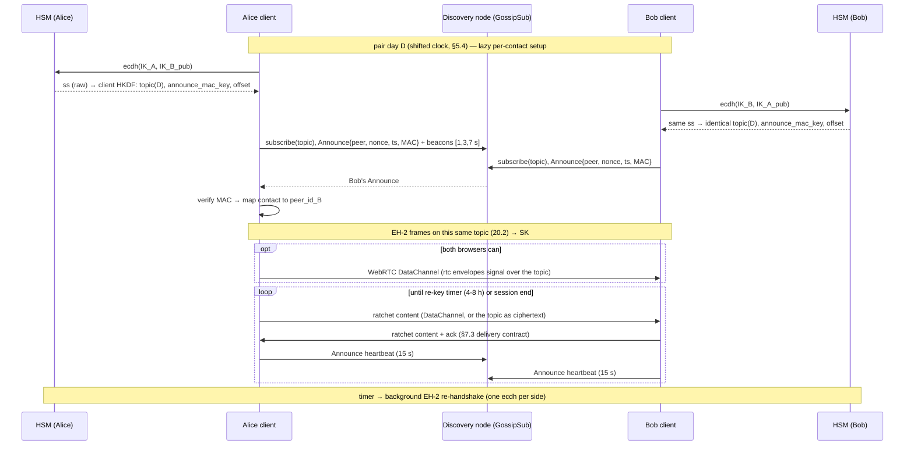
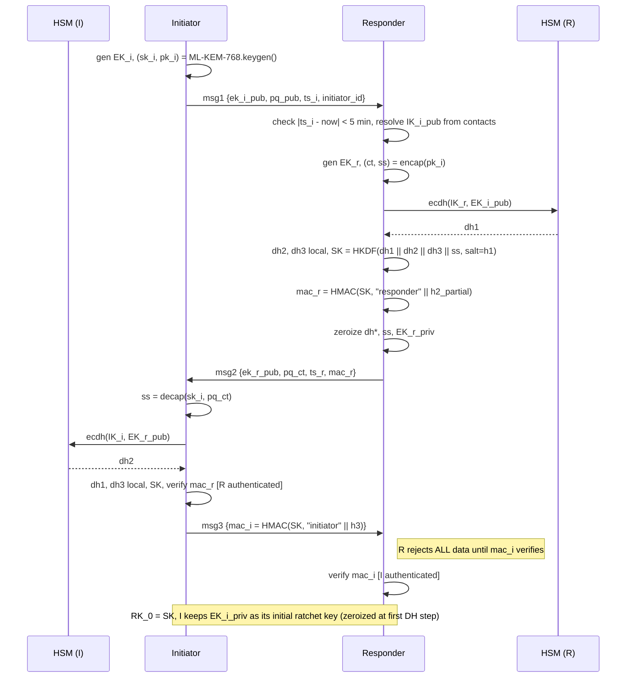
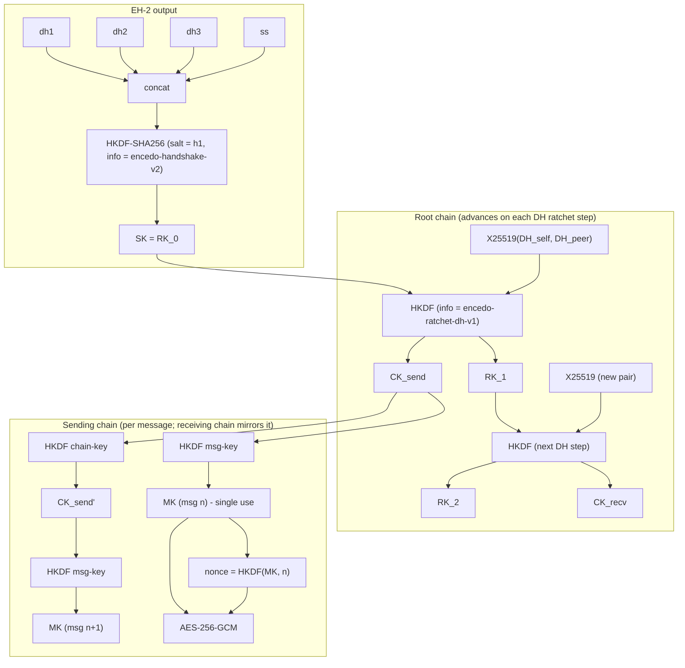
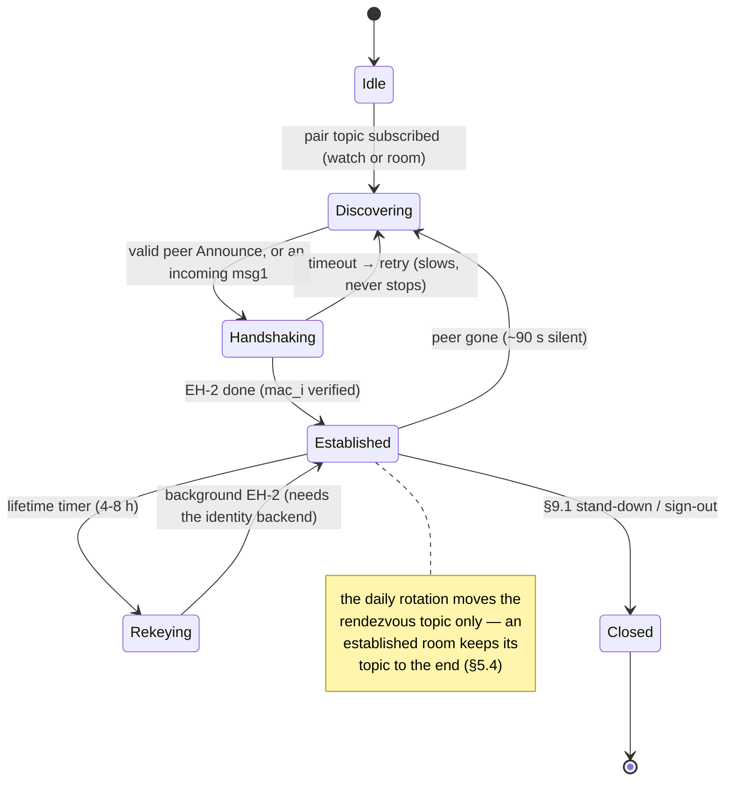
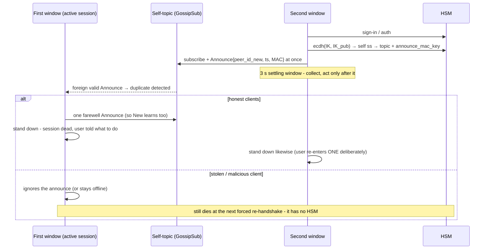

# v6 — PROTOCOL.md

Status: **normative protocol reference (protocol version 1, key schedule "v2" / EH-2) — describes the shipped implementation** (`impl/`, deployed as onchato 0.5.x). Kept 1:1 with the code: a wire behaviour the client has and this document omits, or the reverse, is a defect in one of them. Earlier drafts and the Proposal history are in git.

This is the single source of truth for the chat protocol: identity, rendezvous, handshake, ratchet, groups, files, session management, transport, cryptographic analysis, PQ roadmap, and the implementation map. It stands alongside `ARCHITECTURE.md` (product & infrastructure — why and where this runs) and `THREAT-MODELS.md` (deployment profiles — against whom).

The design targets a **synchronous, HSM-anchored, post-quantum-hybrid** secure messenger for private, commercial, and critical-infrastructure use. It ships in two go-to-market channels from one core: **Encedo Chat** (enterprise/tenant: EPA HSM, OIDC, DORA/NIS2 framing) and **onchato** (open public network: self-hosting, community UIs, takedown resistance).

---

## 1. Summary

- **HSM-anchored identity** — the identity private key never leaves the HSM (Encedo PPA or EPA, reachable over REST/TLS 1.3). Chat's entire HSM crypto surface is a single call — `ecdh` — plus key management (generate / import / delete / search). A **software identity** (§4.5) implements the same contract with a password-sealed key for onboarding without hardware, at reduced assurance.
- **Post-quantum hybrid confidentiality from day 1** — the handshake combines classical ECDH (X25519) with a post-quantum KEM (ML-KEM-768); "harvest now, decrypt later" is defeated.
- **One identity key** — native X25519, purpose `ecdh` enforced by an HEM flag. No dual-use, no curve conversion, no dormant keys. It never signs.
- **Deniability** — authentication by MAC over the transcript, not by signature.
- **Metadata privacy** — deterministic, daily-rotated rendezvous topics; ephemeral PeerIds; no central server.
- **Synchronous model** — no store-and-forward; both parties must be online. This is what eliminates prekeys, prekey servers, and multi-device ratchet sync. The one bounded exception is a shared **file**: its ciphertext rests on an operator store for minutes (§7.5).
- **Single active session** per identity — a duplicate session is detected on the self-topic and **both** copies stand down (§9.1).

Transport: **libp2p** (WebSocket Secure to a discovery node + GossipSub; WebRTC DataChannel as the opportunistic 1:1 direct plane). Clients: one TypeScript engine consumed by the web app, the CLI, and the Tauri 2 shells (desktop + Android) — the shells wrap the same web bundle, so crypto and transport run in the webview on every platform (§3.2).

**Conscious v1 tradeoff:** confidentiality is PQ-safe; **authentication remains classical** until Phase 3 (§15). A future active quantum MITM is the only unaddressed threat, realistic for state-level adversaries against high-value targets around 2035–2040; the in-band migration path (§15) closes it before then.

---

## 2. Goals & threat model

### 2.1 Security goals (all simultaneously)

| Goal | Meaning |
|---|---|
| Confidentiality | Message content available only to conversation participants |
| Integrity | In-transit modification is detected |
| Mutual authentication | Both sides authenticate via their long-term IK |
| Forward secrecy (FS) | IK compromise does **not** expose past sessions |
| Post-compromise security (PCS) | Ratchet-state compromise heals after some new messages |
| PQ hybrid | Confidentiality holds if **either** ECDH or ML-KEM survives |
| Deniability | After a session, neither side holds cryptographic proof the other authored a message |
| Metadata privacy | A network observer cannot determine who talks to whom from libp2p traffic alone |

### 2.2 Adversaries

**In scope:** passive network observer (sees all libp2p traffic, GossipSub topics, WebRTC DataChannel flows; cannot break TLS 1.3, DTLS, or libp2p Noise); active MITM on the transport; compromise of the long-term IK (HSM theft / insider); compromise of ratchet state (device theft with live cache); compromise of individual message keys (side channel); quantum "harvest now, decrypt later".

**Out of scope:** HSM core compromise (firmware-level — assumed trusted, it is its job to protect keys); endpoint compromise (root on a running client reads plaintext at display time — no E2E protocol solves this); ISP-level statistical traffic analysis (timing/size — the protocol protects logical metadata, not statistical); coercion (organizational, not protocol); DoS by flooding rendezvous (rate-limited per real client IP at the reverse proxy — the deployed control, since GossipSub's own IP scoring is off behind it; §16 P4, `relay/README.md`).

### 2.3 Environment assumptions

- HSM is trusted (firmware correctly implements primitives, protects private keys).
- TLS 1.3 client↔HSM negotiates the **hybrid group X25519MLKEM768** (verified in Chrome) — the transport to the HSM is itself PQ-hybrid, so no segment of the data path relies on classical crypto alone.
- Both HSM and client have a CSPRNG.
- Clocks synchronized to ±5 min of UTC (typically NTP).
- **Out-of-band contact import** establishes public-key authenticity (in-person QR, fingerprint verification, admin enrollment). The protocol does **not** solve trust establishment.

### 2.4 Simplifying assumptions and what they buy

| Assumption | Consequence |
|---|---|
| No offline messages | Eliminates prekey bundles, OPK pools, server-side prekey storage |
| Single active session per user | Eliminates multi-device ratchet synchronization |
| Contacts imported out-of-band | Eliminates key-transparency / CDS infrastructure |
| Shared sender key for groups | Eliminates pairwise handshake per message for each group member |

---

## 3. Layered architecture

```
┌───────────────────────────────────────────────────────────┐
│ UI packages (ui-*)          — replaceable skins           │
├───────────────────────────────────────────────────────────┤
│ Core API                    — commands / events / snapshot│
├───────────────────────────────────────────────────────────┤
│ Message layer               — envelope (§7.4) · cache     │
├───────────────────────────────────────────────────────────┤
│ Session layer                                             │
│   EH-2 handshake · Double Ratchet · Sender Keys (groups)  │
├───────────────────────────────────────────────────────────┤
│ Identity & rendezvous (HSM-anchored)                      │
│   IK in HEM · deterministic topics · Announce ·           │
│   self-topic · single active session                      │
├───────────────────────────────────────────────────────────┤
│ Transport (two planes)                                    │
│   control + fallback content: GossipSub over a discovery  │
│   node · data (1:1, browser): WebRTC DataChannel          │
├───────────────────────────────────────────────────────────┤
│ libp2p     js-libp2p (every client) · MQTT fall-back      │
├───────────────────────────────────────────────────────────┤
│ HSM layer  HEM REST over TLS 1.3 (X25519MLKEM768)         │
│   ecdh (raw) · key_search · key_generate · key_import     │
└───────────────────────────────────────────────────────────┘
```

The protocol assumes **no security property from libp2p** beyond hop-to-hop transport encryption; all guarantees come from the session layer.

### 3.1 Responsibility split

- **HSM** — key management (create/import/delete/search) and one crypto operation on IK: **raw `ecdh`** (the current HEM firmware exposes no in-HSM HKDF). Every IK-derived HKDF — topics, announce MAC keys, rotation offset, the per-store keys over the §10 cache base (itself a raw ECDH) — therefore runs **client-side over the raw ECDH output** (§4.3), and the raw pair secret transits client RAM. When firmware ships `ecdh`+HKDF in one call, these derivations move in-device and the exposure closes (§4.3 records the consequence precisely).
- **Client** — all ephemeral operations (EK, ML-KEM keygen/encap/decap, AEAD, ratchet), all HKDFs, session state, cache, presence.
- **libp2p** — pubsub for rendezvous, handshake frames, and the fallback content path; a WebRTC DataChannel where both browsers can open one.

### 3.2 Client tiers — what ships

- **One TypeScript engine** (`impl/lib/`, `impl/eh2/`, `impl/net/`) consumed by three front-ends: the web app, the CLI, and the **Tauri 2 shells** (Linux/Windows/macOS desktop + Android). The shells wrap the same web bundle in a native window: **all crypto and transport run in the webview** on every platform. What the shell adds is platform reach — tray, autostart, notifications, single-instance, self-update, and the Android foreground service — not isolation.
- Crypto libraries: WebCrypto for X25519/HKDF/HMAC/SHA-256/AES-GCM; `@noble/post-quantum` for ML-KEM-768 (the single third-party crypto dependency).
- **The hardened tier — a Rust core keeping keys and ratchet state outside the webview, `core-rs` compiled natively and to WASM — is a roadmap item, not the build.** Until it exists, webview compromise reaches ratchet state on every platform alike; the mitigations of S1/S5 (§11.3) read accordingly.
- Platform limit worth naming here because it changes the transport story: the **Linux** desktop webview (WebKitGTK) has **no `RTCPeerConnection`** — measured in the packaged app, with the relevant WebKit settings enabled — so the Linux desktop build's content always rides the relay (§13; Windows/macOS shells use different webviews and are untested on this point).

### 3.3 No application server

There is no prekey server, directory service, or message relay for text. The central points are the **HSM** (EPA, per-tenant, Encedo-provided or self-hosted), the **libp2p discovery nodes**, and — for shared files only — an operator **IPFS store** that holds ciphertext for minutes (§7.5). Standard p2p infrastructure otherwise — see `ARCHITECTURE.md`.

---

## 4. Identity & keys

| Key | Type | Where | Lifetime | Used for |
|---|---|---|---|---|
| **IK** | X25519, purpose=`ecdh` (HEM flag) | HSM (PPA/EPA) — or password-sealed on device for a software identity (§4.5) | permanent | EH-2 DHs, topic derivation. **Never signs.** |
| **EK** | X25519 | client RAM | one handshake (initiator's EK doubles as its initial ratchet key — §6.2) | EH-2 forward secrecy |
| ML-KEM pair | ML-KEM-768 | client RAM | one handshake | PQ hybrid component |
| Ratchet state (RK/CK/MK) | symmetric | client RAM (webview) | session | per-message keys |
| Sender key (`chain_key`) | symmetric | client (encrypted cache §10) | group epoch | group messages (§8) |
| **GK** (group identity) | X25519 | admin: HSM keypair; member: `GK_pub` entry | group lifetime | group marker + roster MAC (§8) |
| `emp_pub` | X25519 public value | localStorage, plain | per profile | the device half of the §10 cache base |
| libp2p PeerId | Ed25519 (libp2p) | client RAM | one app start | transport only; unlinked to IK |
| Node key | Ed25519 (libp2p) | derived from the node's `--pass` seed | permanent | node identity, pinned in the compiled-in node list (§5.6) |

### 4.1 Key-per-purpose

IK does not sign anything — deniability (§6.4) excludes handshake signatures, groups authenticate by ECDH-derived HMACs (§8), and topics rest on ECDH only. **There is no signature anywhere in the protocol.** A key declared Ed25519 (even dual-flagged) would carry a capability the protocol never uses, plus a Montgomery-conversion step per operation. HEM enforces purpose separation by hardware flag, so separation is a property of the device, not of implementation discipline. **No key sharing across products** (Chat, Mail/PGP, Vault, Identity have separate HSM keys) — removes joint-security questions from a whole-stack audit. **No dormant keys** — an unused key is not a security property.

### 4.2 DESCR (key metadata)

Two HSM fields with different consumers: `label` is what a human sees in the device's own key list (a 32-limit the client enforces in **UTF-8 bytes**, the conservative reading of the firmware's "32 characters"), `descr` is what the client searches and reads (**128 bytes**, a fixed record that silently truncates). The prefix must be ≥ 6 bytes because the HEM's `allow_keysearch` matches the first six (`ETSEIC`, not a 4-byte `CHAT`), and it carries a **generation digit** so the next format change leaves old records inert rather than misread.

```
IK     label  Onchato-IK-<handle>                       (truncated to fit)
       DESCR  ETSEIC:self1,<handle>
PEER   label  Onchato-Peer-<name>                       (truncated to fit)
       DESCR  ETSEIC:peer1,<owner_KID base64url>,<name>
GROUP  →  the marker format is defined in §8
```

- **The identity's ID is the KID of its own IK entry** — `KID = SHA-1(pub)[0:16]`, a firmware-defined index on key content, so the same identity on another device has the same ID and nothing new is minted or stored. (SHA-1 truncated to 128 bits: hijacking a specific KID is a second preimage on 2¹²⁸; SHA-1's chosen-prefix collision weakness does not lower that, so truncated SHA-256 would change no attack cost here.)
- **Contacts are scoped by the owning identity's KID.** `key_search` matches an anchored prefix, so `ETSEIC:peer1,<owner_KID>,` returns exactly one identity's contacts. Field order is fixed for every generation: identifiers of fixed width first, free text last, **the name read as the whole tail** (it is user-supplied and may contain the delimiter).
- **A contact belongs to exactly one identity per device** — the HEM refuses to hold the same public key twice, whatever DESCR it sits under. The client predicts this without touching the device (it can compute the KID from the public key) via one broad `key_search("ETSEIC:peer1,")` on the add path, and says which identity holds the contact instead of surfacing a device error.
- There is **no `fp=` field**: verifying `KID == SHA-1(pub)[0:16]` gives what a stored fingerprint gave without spending 32 bytes. Neither defends against an attacker who can write to the HEM (they would replace key and identifier together) — the real protection is §4.4's out-of-band verification at import.
- Two identities may be signed in at once (two tabs); §9.1 is per-identity so they never see each other. All per-identity client state is keyed by the **KID**, never the handle — handles may repeat and may be edited.

Contacts are stored as **public keys with metadata**, not private keys. Import (QR / invite link) carries one X25519 pubkey; the user compares a fingerprint (`SHA-256(pub)`, §4.4) out-of-band. The invite itself is a URL fragment `#i=base64url(JSON { p, n, r? })` — `p` the pubkey (base64, exactly 32 bytes), `n` a display name (≤ 64 chars, control/format characters stripped), and `r: 1` marking a **reply** to an invite, so the receiver adds the contact without sending its own key back again.

### 4.3 HSM operations

The current HEM firmware exposes **raw `ecdh` only** — there is no in-HSM HKDF yet. The design target (and the assumption earlier drafts were written against) is `ecdh`+HKDF in one call, so that IK-derived secrets never leave the device; **until that firmware ships, every IK-derived HKDF runs client-side over the raw ECDH output.**

| Operation | Use | Frequency |
|---|---|---|
| `ecdh(kid, peer_pub)` → raw 32 B | EH-2 DHs (§6.2); the base of every IK-derived HKDF: pair topic (§5.1), announce MAC keys (§5.5), rotation offset (§5.4), the cache base (§10) | 1/handshake; 1/contact/session (memoised) |
| `key_generate(type=X25519, purpose=ecdh)` | IK at onboarding; GK at group creation | once/user, once/group |
| `key_import(pub)` | contact IK_pub; a member's `GK_pub` (§8) | once/contact, once/group |
| `key_delete(kid)` | contact removal, group leave, IK rotation (§16 P6) | rare |
| `key_search(prefix)` | resolve identities, contacts, group markers | sign-in + add paths |
| `getPubKey(kid)` | read a public half (until `key_search` returns them) | per contact/group at sign-in |
| `exdsa_sign` | **not used** — deniability requires MAC, not signature | zero |
| ML-KEM / ML-DSA in HSM | **not used in Phase 1** — ML-KEM is ephemeral & client-side; long-term PQ key only from Phase 3 (§15) | zero |

Everything else (HMAC, AES-GCM, ML-KEM, ratchet, every HKDF) is client-side with standard libraries. **Zero firmware changes for Phase 1.**

**Consequence of client-side HKDF, stated precisely:** the pair secret `ss = ECDH(IK_a, IK_b)` sits in client RAM (memoised per contact per session). It is **rendezvous-only material** — disjoint from the message-key DHs — so its exposure does not affect message confidentiality; what a compromised client leaks is metadata-linkability of that pair until an IK rotates. EH-2 needs raw mode regardless (the DH outputs are concatenated client-side and zeroized after `SK` derivation). When HKDF-in-HSM firmware lands, the derivations move in-device and this paragraph tightens to "raw mode only inside EH-2".

### 4.4 Contact integrity

Contacts are public keys (confidentiality not critical); **integrity is critical** — an attacker swapping a contact's IK_pub achieves a perfect MITM: the client derives the rendezvous with the attacker, handshakes with the attacker and encrypts to the attacker, with every layer below working perfectly on the key it was handed. Protection, per store:

- **HEM-held contacts:** HSM authentication (scoped token) gates key modification as a privileged op; the KID indexes key content.
- **The local contact book** (software identities; the local cache for HEM ones): a **keyed MAC over the stored text** — `HMAC(k)` with `k = HKDF(base, salt="encedo-chat-contact-book-v1", info=idKey)`, `base` from the §10 schedule — verified once at sign-in. The key is derivable only by the identity holder, and binding `info` to the identity's key makes a book copied between profiles fail. `unsigned` (a pre-MAC book) is accepted and upgraded; **`tampered` is not used and not overwritten** — the mismatching text is evidence. MAC, not encryption, by decision: reads stay synchronous, and secrecy of public keys buys nothing.
- **At import**, both: out-of-band fingerprint verification (`SHA-256(pub)`), and pinning what was verified.

### 4.5 Software identity

A first-class identity backend for onboarding without hardware (and the packaged clients' default): a WebCrypto **X25519 keypair generated on device**, private half sealed with a password (PBKDF2-SHA256, 1 000 000 iterations, per-profile random salt → AES-GCM) in localStorage. It implements the same `Identity` contract as a HEM — one `ecdh` capability — and interoperates byte-for-byte with HEM identities; nothing downstream knows which backend it talks to.

Honest assurance difference: the key is **on the user's disk under a password**, not in hardware — theft of the sealed blob plus a guessed password is the identity, the §9.3 dead-man's-switch does not apply (a re-handshake needs no device), and the profile-export file (§10) carries the whole identity under that same password. Multiple software profiles per browser are supported; each is its own identity with its own KID-scoped state.

---

## 5. Rendezvous & discovery

### 5.1 Pair topic

```
shared_secret  = ECDH(IK_a_priv, IK_b_pub)            // HSM call; equal on both sides
topic_material = HKDF-SHA256(
                   ikm  = shared_secret,
                   salt = "encedo-chat-rendezvous-v1",
                   info = network_id || 0x00 || date_UTC,
                   L    = 32)
topic          = base32(topic_material)[0:52]
```

- `date_UTC` = `YYYY-MM-DD` **on the pair's shifted clock** (§5.4 — each pair rolls over at its own instant, not at 00:00 UTC).
- `network_id` (the `--network` identifier, default `main`) is mixed in so independent networks are disjoint even if their nodes interconnect by accident. `0x00` is a domain separator against ambiguity between `network_id` and date.
- Topic is indistinguishable from random without `shared_secret`. **Circular knowledge requirement:** to map a topic to (Alice, Bob) an observer must already know both IK_pubs — i.e. already know the relationship they seek.
- The HKDF runs client-side over the raw `ecdh` output (§4.3 firmware phase); `ss` is computed **lazily** (first use per contact per session) and memoised, not batched at midnight (see §16 P2 on rate limits).

### 5.2 Self-topic

Same construction and the **same salt** as the pair topic, with `ss = ECDH(IK_a_priv, IK_a_pub)` — a DH of the key with itself. Only the IK holder can compute that value, so the self-topic is **not publicly computable**: an observer holding IK_pub alone can neither find it nor confirm presence on it (the presence-leak register entry S2 records this). The same `ss` keys the announce MAC (§5.5), so anything validly MAC'd there is another window of the same identity. Used for duplicate-session detection (§9.1). Derivation is best-effort: an identity whose backend refuses a self-ECDH runs without the §9.1 rule rather than failing.

The self-topic **rotates at plain UTC midnight** (there is no pair to derive a §5.4 offset with), under the same ±30 min guard: within it the watch holds **both** adjacent days' topics, and a re-evaluation tick (60 s) walks the date, so §9.1 keeps firing across midnight — including against a window that slept through it. The self-DH is done once per session; each day's topic and MAC key derive from it client-side, so a rollover costs no device call.

### 5.3 Group topic

Same construction with a client-side seed and its own salt:

```
topic = base32(HKDF-SHA256(
          ikm  = group_secret,
          salt = "encedo-chat-group-rendezvous-v1",
          info = network_id ‖ 0x00 ‖ date_UTC,
          L    = 32))[0:52]
```

**Seed.** `group_secret` is a random 32-byte value the group's admin generates and distributes pairwise (with the sender keys, §8) over existing 1:1 sessions; it is **rotated on every membership change** (new epoch → new `group_secret`). It lives **client-side** (the encrypted cache, §10), **not** in the HSM — a disposable metadata seed, kept forward-secret with the rest of the group state. The HKDF runs client-side (the ikm is not an HSM secret). A removed member holds only the old `group_secret` → cannot derive the new topic; with the sender-key rotation (§8) it can neither find nor read the group.

**Rotation.** The topic rotates **per epoch** (membership change) and **daily at plain UTC midnight** (no pair secret exists to derive a §5.4 offset from, so groups use offset 0). Within the same ±30 min guard the room holds **both** adjacent days' topics — keepalives (§8.5) go to every live topic so the next day's mesh is warm before anyone crosses, sends go to the current day's — and a 60 s tick walks the date, so a session that slept through midnight re-converges on its next tick or `refresh()`. Both members run the same clock rule and cross together.

**Rejected seeds** (recorded for the auditor):
- *A per-group public key `GK_pub` as ikm*: `GK_pub` is a stored, retrievable HSM value, so a HEM dump would compute the topic. `GK` is kept as the group **identity/marker** and roster-MAC key (§8), **not** the topic seed — separated so a `GK_pub` leak does not expose the topic.
- *A contributory group DH `abc·G`*: correct and HEM-native, but a multi-round synchronised ceremony re-run on every membership change, fragile over async GossipSub — for a value that is random either way, not worth it.

### 5.4 Daily rotation — per-pair instant

The pair topic rotates daily, but **each pair rolls over at its own instant**, derived from the pair secret — not at 00:00 UTC. Two things follow: rotations spread ~uniformly across 24 h across the user base (no synchronized midnight re-subscribe spike on the discovery nodes), and both members derive the **identical** offset, so they cross together and the overlap shrinks to a skew/propagation guard.

**Derivation** (date-independent, so computed once per contact and cached until IK rotation; client-side over the raw `ecdh` output, §4.3):

```
rotation_material = HKDF-SHA256(
                      ikm  = shared_secret,
                      salt = "encedo-chat-rotation-v1",
                      info = network_id || 0x00,          // NO date — the offset is stable per pair
                      L    = 4)
offset_seconds    = be32(rotation_material) mod 86400     // rollover time-of-day, seconds past 00:00 UTC
```

The offset is secret to the pair — derived from `shared_secret`, so not predictable without a private IK, exactly like the topic.

**Rollover rule.** The mechanism is *shift the clock back by the offset, then apply a plain 00:00 rollover*: the pair's rendezvous day is `utcDate(now − offset_seconds)`, and it goes into `date_UTC` of §5.1.

- Within ±`guard` (**30 minutes** default) of the pair's rollover instant, subscribe **both** adjacent days' topics — two topics, never three; otherwise the current day only. Because both members share `offset_seconds` they cross together, so the guard covers only clock skew + GossipSub mesh-graft propagation. (A per-*client* jittered offset, which the members do NOT share, would need a wide overlap to cover the disagreement — rejected.)
- Announce on every active day's topic; a contact is online if it announces on **any** of them. Publish content on the current day's topic under this schedule.
- A conversation held open **across** a rotation keeps its topic to the end (both sides consistent) — live re-rendezvous of an established room is deliberately out of scope; new conversations open on the pair's current rendezvous day.

**Clock source.** Clients run on the local clock; the 30-minute guard absorbs ordinary device skew (the ±5 min assumption of §2.3 sits well inside it). *Future, non-normative:* anchoring to an HTTPS `Date` header from an operator host (SNTP-style RTT correction, clamped, soft hint only) would let the guard shrink to seconds; it is not implemented.

**Compatibility.** Two implementations MUST agree on this schedule: a client applying the offset and one on fixed-midnight would miss each other for up to `offset_seconds`. The whole deployment cut over together.

*Test hook:* `forcedRotationSec` (web `?rot=<hour>`) overrides every pair's offset with one fixed time-of-day so a topic-hop can be watched on demand; behaviour is otherwise identical, and absent the flag the per-pair algorithm is the only one.

### 5.5 Announce (presence)

Published on pair topics and the self-topic — never on group topics (those carry the §8 keepalive instead). Cadence on **pair topics**: at join, early beacons at **[1 s, 3 s, 7 s]** (the first Announce goes out before the relay grafts the topic's mesh and reaches nobody), then a heartbeat every **15 s**. On the **self-topic**: one Announce at subscribe (no beacons), a heartbeat every **10 s**, and a farewell Announce on §9.1 stand-down. This is also the room-presence signal ("is Y in the park yet").

**Wire encoding** (normative — a second implementation must interoperate): a UTF-8 JSON object `{ v, peer, nonce, ts, mac }` with `v = 1`, `peer` the sender's PeerId string, `nonce` = base64 of 16 random bytes, `ts` unix ms, and

```
announce_mac_key = HKDF-SHA256(ikm  = shared_secret,    // the pair ss; the self-DH value on the self-topic
                               salt = "encedo-chat-announce-mac-v1",
                               info = network_id || 0x00 || date_UTC,
                               L    = 32)
mac = base64( HMAC-SHA256(announce_mac_key, ASCII("<v>|<peer>|<nonce>|<ts>")) )
```

— the MAC message is the ASCII string of the four fields joined with `|`, not a binary concatenation. `announce_mac_key` derives client-side from the memoised pair `ss` (§4.3), once per contact per day.

Receiver: check `v` and shape; timestamp ±5 min (replay); MAC verify (WebCrypto `subtle.verify`, constant-time); then the subscriber deduplicates by nonce (a per-watch cache pruned past twice the replay window — a nonce the timestamp check would refuse anyway is not worth remembering). On success update `contact → peer_id`. The PeerId↔user mapping exists **only** inside this MAC'd channel; IK_pub never appears on the wire.

**Presence without a conversation.** Each contact gets a light watch on the pair topic — subscribe, Announce on the heartbeat, report whether the contact is announcing — so being *visible* to twenty contacts costs twenty subscriptions, not twenty handshakes. The watch also hears an incoming EH-2 msg1 and hands the topic over warm to a full room ("upgrade on send" — the receiver never has to open the conversation first). A peer silent for ~35 s (2.5 missed heartbeats) is reported `quiet`; ~90 s counts as gone.

### 5.6 Discovery nodes (transport infrastructure)

Operator-run libp2p nodes (two in production: bs1, bs2; a third precomputed) — GossipSub (flood + seen-cache dedup between nodes) + circuit-relay-v2 reservations, behind nginx (WSS/443). Network isolation is **cryptographic, not operational**: `network_id` enters every topic derivation, so foreign networks cannot collide even on a shared node — the node itself has no network flag. A node's Ed25519 key is derived from its `--pass` seed, so its PeerId is knowable before the machine exists. Topic budget: a **hard cap on concurrent live topics** (default 250) *plus* **TTL eviction** (a topic silent for the idle TTL returns its slot; a topic with heartbeats is never evicted). When the cap bites, the client sees an empty room and the relay logs the refusal — watch for it.

**The node list** ships **compiled into the client** (`infra/nodes.json`) and can be refreshed at runtime by fetching a **compiled-in IPFS CID** — content addressing is the whole of the list's integrity (a new list means a new build); there is no signature on it. The client dials the list in order and fails over down it; the user can reorder or override locally. Full node-operations detail in `relay/README.md` and `ARCHITECTURE.md`.

---

## 6. Handshake — EH-2

Interactive, Noise-XX-flavored with an ephemeral ML-KEM extension. **1.5 round-trips** (msg1 → msg2 → msg3_confirm). The frames ride the **pair topic itself** (GossipSub, unsealed — told apart from content by their type byte, §6.1); no separate stream is opened for the handshake. **Whoever is in the room initiates on discovery** — nobody waits for a tie-break, because a presence watch is passive and the sender must be able to open (§5.5); **crossed msg1s** are settled on receipt: the lower PeerId keeps its own in-flight attempt (for a 2 s window) and ignores the incoming msg1, the higher one yields and responds. Produces `SK` (32 B) = `RK_0`.

Delivery discipline, normative because GossipSub is fire-and-forget:

- the opening frame is re-sent a few times while an attempt waits; a silent attempt times out and is retried on a backoff that slows (settling at roughly one attempt per 10 s) but never stops;
- a **byte-identical repeat of msg1** (the initiator re-sending) gets the **stored msg2 replayed**, not a fresh attempt — a fresh responder ephemeral would doom the initiator's `mac_i`;
- a *new* msg1 restarts a responder that already holds a session (peer reloaded / rotated its PeerId), the session being replaced only once msg3 verifies;
- a responder that receives msg1 carrying an `initiator_id` that does not match the contact it holds a key for ignores that peer for 5 minutes — this is the one conclusive identity statement (a failed MAC is not: honest crossed handshakes produce those routinely);
- content typed before establishment queues in a bounded buffer (32 envelopes) and flushes when the session is live; overflow is dropped.

### 6.1 Messages

```
I → R  msg1 { version, ek_i_pub, pq_pub (ML-KEM-768), timestamp, initiator_id = SHA-256(IK_i_pub)[0:8] }
R → I  msg2 { version, ek_r_pub, pq_ct, timestamp, mac_r }
I → R  msg3 { version, mac_i }
```

**Serialization (normative — `h1 = SHA-256(serialize(msg1))` salts `SK`, so two encodings of one frame are two different session keys):**

```
msg1 = 0x01 ‖ ver(1) ‖ ek_i_pub(32) ‖ u16be(|pq_pub|) ‖ pq_pub(1184) ‖ u64be(ts_ms) ‖ initiator_id(8)
msg2 = 0x02 ‖ ver(1) ‖ ek_r_pub(32) ‖ u16be(|pq_ct|)  ‖ pq_ct(1088)  ‖ u64be(ts_ms) ‖ mac_r(32)
msg3 = 0x03 ‖ ver(1) ‖ mac_i(32)
```

`ver = 1`; trailing bytes are rejected (a frame parses exactly or not at all). The type bytes are the discriminators of §6's "told apart by their type byte" — `0x01–0x03` handshake, `0x10` ratchet content (§7.2), `0x20`/`0x21` group (§8.2). In `h2_partial` (§6.2), `ts_r` enters as the same `u64be`.

`initiator_id` is a non-security hint for R to resolve IK_i_pub from its contact book.

### 6.2 Key schedule

```
h1  = SHA-256(serialize(msg1))
ss  = ML-KEM-768 encapsulate (R) / decapsulate (I)
ikm = DH(IK_r, EK_i) || DH(EK_r, IK_i) || DH(EK_r, EK_i) || ss
SK  = HKDF-SHA256(ikm, salt = h1, info = "encedo-handshake-v2", L = 32)

h2_partial = SHA-256(serialize(msg1) || EK_r_pub || ct || ts_r)
mac_r = HMAC-SHA256(SK, "responder" || h2_partial)      // R authenticates to I (in msg2)
h3    = SHA-256(h2_partial || mac_r)
mac_i = HMAC-SHA256(SK, "initiator" || h3)               // I authenticates to R (in msg3)
```

Each side makes exactly **one identity-backend ECDH call** (the DH involving its own IK); the other two DHs are local. Erasure, stated precisely because it is what an auditor will check: `dh1`, `dh2` and `ss` are wiped as soon as `SK` is derived; **`dh3` deliberately survives** — it is the first DH-ratchet step's ikm (below, §7.2) and is wiped when that step consumes it at ratchet construction. `sk_i` lives inside the ML-KEM decapsulation closure and is dropped, not explicitly zeroized (a JS-runtime limit); the `EK_*` private halves are non-extractable WebCrypto `CryptoKey`s — droppable, usable under compromise, but not exportable and not zeroizable from script. **`EK_i_priv` lives longest:** R seeds the ratchet's first `DH_peer_pub` with `EK_i_pub` from msg1 (saves one round), so I keeps `EK_i_priv` as its initial ratchet private key until the first DH-ratchet step replaces it.

Two rules the wire flow implies but implementers miss:

- **msg3 gates the responder.** I holds `SK` after msg2 and may transmit immediately after msg3; **R MUST NOT accept any application/ratchet message from I until `mac_i` (msg3) verifies** — before that moment I is unauthenticated.
- **`pq_ct` binding.** The ML-KEM ciphertext does not enter SK derivation directly (only `ss` does); it is authenticated via `h2_partial` inside both MACs, and FIPS 203 binds (pk, ct) → ss internally.

### 6.3 DH ordering (critical for correctness)

Both sides concatenate DH outputs in **responder perspective**:

```
ikm = DH(IK_r, EK_i) || DH(EK_r, IK_i) || DH(EK_r, EK_i) || ss
```

The initiator computes the same values from the other side via X25519 commutativity (`DH(EK_i, IK_r) == DH(IK_r, EK_i)`). **This mismatch is the single most common "SK doesn't match" bug — write it as the first test.**

### 6.4 Analysis

- **Mutual authentication.** R authenticates I via msg3: only the holder of `IK_i_priv` can compute `DH(IK_i, EK_r)` → derive `SK` → produce `mac_i`. I authenticates R via msg2 symmetrically on `DH(IK_r, EK_i)`.
- **Forward secrecy.** Compromising `IK_*_priv` after the session does not recover `SK` — the zeroized ephemerals `EK_*`, `sk_i` are also required.
- **PQ hybrid.** `SK = f(dh1 || dh2 || dh3 || ss)`; `dh*` rest on ECDLP (classical), `ss` on MLWE (ML-KEM-768, PQ). Breaking one problem is insufficient: `SK` confidentiality holds while **either** assumption stands. Concatenation-in-HKDF is the standard hybrid combiner (draft-ietf-tls-hybrid-design; Bindel et al. 2019). Framing for the auditor: EH-2 is an **AKE** (MAC-authenticated, Noise-style) whose classical component is a NIKE (X25519), not a CCA-secure KEM — the security argument lives at the AKE level, not as "two IND-CCA2 KEMs combined".
- **Deniability.** No long-term-key signatures. Both MACs use `SK`, shared by both parties — either could have produced any MAC on `SK` post hoc, so neither holds proof of authorship (offline/non-repudiation deniability). Online real-time deniability would need ZK proofs (not used; unnecessary for the target).
- **KCI resistance.** An attacker with `IK_r_priv` still cannot impersonate someone else *to* R: forging `mac_i` needs `SK`, needing `dh2 = DH(IK_i_priv, EK_r_pub)`, needing `IK_i_priv`.
- **Replay protection.** (1) timestamps ±5 min; (2) `h1 = SHA-256(msg1)` salts `SK`, so every session's `SK` differs; (3) the Announce nonce dedup — a per-watch bounded cache (§5.5).

---

## 7. Messaging — Double Ratchet

Signal-style; `RK_0 = SK`.

### 7.1 State (per conversation)

```
DR_State { RK, CK_send, CK_recv, DH_self_priv, DH_self_pub, DH_peer_pub,
           N_send, N_recv, PN, skipped_keys: map<(DH_pub, N), MK> }
```

### 7.2 Steps

```
DH step:        RK', CK = HKDF-SHA256(ikm = X25519(DH_self, DH_peer), salt = RK,
                                      info = "encedo-ratchet-dh-v1", L = 64)
Message key:    MK       = HKDF-SHA256(CK, salt = ∅, info = "encedo-msg-key",   L = 32)
Chain advance:  CK'      = HKDF-SHA256(CK, salt = ∅, info = "encedo-chain-key", L = 32)
Nonce:          12 B     = HKDF-SHA256(MK, salt = ∅, info = "encedo-aead-nonce" || u32be(N), L = 12)
AEAD:           AES-256-GCM(MK, nonce, plaintext, aad = header)
Header (wire):  0x10 ‖ ver(1) ‖ dh_pub(32) ‖ pn(u32be) ‖ n(u32be)      — 42 bytes, and ALL 42 are the AAD
```

Where the chain labels appear without a salt, the label is the **info** and the salt is empty — mixing that up derives different keys (the topic/announce/group-auth derivations of §5 and §8.1 use the label as the *salt*; the two families differ and both are normative as written).

**The first root step is immediate and consumes the handshake's `dh3`.** At ratchet construction both sides run one DH step with `ikm = dh3` (= `DH(EK_r, EK_i)`, §6.2) against `RK = SK`, after which `SK` is zeroized: the initiator receives `CK_send`, the responder `CK_recv` (the responder has no sending chain until its own first DH step). The initiator's first header therefore carries `dh_pub = EK_i_pub`. A second implementation that starts from a bare `RK_0 = SK` without this step derives nothing the shipped client can read.

Nonce via HKDF (not a bare counter) for defensive robustness against implementation nonce-reuse bugs; collisions are mathematically impossible across distinct MKs.

### 7.3 Rules

- MK is single-use, zeroized after use; a state snapshot after message *n* cannot decrypt messages < *n* (per-message FS).
- **Skipped-key bounds** (DoS protection against "future" DH publics): a single counter jump larger than **1000** is refused (the gap bound — not a cap on the total stored); at most **5** superseded receiving chains are retained; unclaimed keys expire after **24 h**.
- **Bounded session lifetime** (S10 mitigation): forced background re-handshake every **4–8 h** (randomised per session, so a fleet does not re-key in lockstep; the **lower PeerId** initiates it), transparent to the UI → hard upper bound on classical-PCS exposure. The replaced ratchet is kept for 60 s so frames already in flight under it still open. A **device switch** forces a fresh EH-2 (new PeerId ⇒ new handshake, new ML-KEM material); a mere relay reconnect keeps the live ratchet and re-sends the backlog. The daily topic rollover by itself does **not** break an established stream. The timer has a second, independent job: it is the hard bound on how long a hijacked live session can survive without the HSM (§9.3).
- **Content plane.** Sealed content prefers a **direct WebRTC DataChannel** between the two peers (browser clients; signalling is the `rtc` envelope, §7.4) and falls back to **GossipSub through the discovery node** — always as ratchet ciphertext, so the relay carries opaque bytes either way. GossipSub is the *only* content path for groups (§8; an N² channel mesh is not a data plane) and for the Linux desktop build (its webview has no `RTCPeerConnection`, §3.2). A DataChannel (label `onchato`) is trusted only after a type-prefixed **2-byte ping/pong** (`0x00 0x50` / `0x00 0x4f`, up to 4 probes at 700 ms) proves both directions, and the first unconfirmed re-send while content rides it demotes the conversation back to GossipSub for its remaining life.
- **Delivery contract** (above the transport, because nothing under it retransmits): `msg` and `file` envelopes carry an `id`; the receiver replies with an `ack` envelope `{ ref, rts }`; an unconfirmed message is re-sent under the **same id** on a widening backoff — **1.5 s, 4 s, 8 s, 15 s, 15 s**, capped at 60 s of budget, plus an **8 s grace** after the last re-send before the ⚠ verdict. The first two tries go out unconditionally; from the third the clock runs only while the peer is still announcing. Running out of budget keeps the bytes and marks the message for a manual re-send; a reconnect re-sends the backlog oldest-first with fresh budgets. Silence from a peer that has never acked at all is read as "old build", not loss.
- Serialization: the application envelope of §7.4, encoded as JSON. A binary encoding (Protobuf, CBOR) would be smaller on the wire and remains open as an optimisation (P3, §16); **nothing in the key schedule, the header or the AAD depends on the encoding** — the ratchet seals opaque bytes.

### 7.4 Application payload (plaintext inside the seal)

What §7.2 seals is a versioned application envelope, not a bare string:
`{ v, t, id, ts, seq, …payload }`. `t` discriminates the payload type, `id` is a short per-message identifier (6 random bytes), `ts` the sender's UTC clock in ms, `seq` a per-sender counter used for de-duplication and display order — **UX only, not a security counter**; replay is prevented by the ratchet, not by `seq`. An unknown `t` decodes as an opaque envelope and is ignored, which is what makes payload additions backward-compatible. Types in use — exactly these eleven: `msg` (text, `format: plain`, never markup), `typing` (`state: start|stop` — sent on input, `stop` after ~4 s idle; `away` follows after ~60 s as a `presence` state), `presence` (`active|away|leave`), `reaction`, `edit`, `knock`, `file` (§7.5 — the blob's CID, content key, and metadata `{ name, size, mime, chunk, chunks, alg, exp }`, plus an optional caption in `body` and an optional `re`), `ack` (`{ ref, rts }` — the id being confirmed and the receiver's clock, feeding the §7.3 delivery contract), `rtc` (the direct-plane signalling of §13), and the group distribution messages of §8 (`group-skd`, `group-skd-req`). It is encoded as JSON; the encoding is an efficiency question, not a security one (§7.3, P3).

Three payload conventions name a person or another message, and therefore belong in this document rather than only in the implementation:

**Mention — `@Name#<hint>` inside a `msg` body.** A mention travels as the visible name the sender used (sanitized — no `@`/`#`, collapsed whitespace, ≤ 48 chars) followed by `#` and **8 hex characters — the first 4 bytes of the mentioned member's public key**. The receiver resolves the hint against the participants of that conversation and renders its **own** name for that key (the sender's spelling is a fallback, never an assertion); a hint matching nobody, or two people, renders as plain text with no highlight. Same rule as `re`'s author hint: a key hint, never a name, so a message cannot claim the presence of a party outside the conversation.

**Reply — `re` on `msg` / `file`.** `re = { id, au?, text }`: the id of the message being answered, optionally the first 4 bytes of its author's public key as a hint, and a bounded copy (≤ 160 code points) of what it said. The copy is there because the transcript is ephemeral (§1, synchronous model) — the receiver usually no longer holds the message being quoted. It is content that already travelled on this ratchet under this key, so quoting costs length, not exposure. The author travels as a **key hint, never a name**: the reader resolves it against the participants of that conversation and displays its own name for that key, and an unresolvable or ambiguous hint is displayed without a name. A quote therefore cannot assert the presence of a party outside the conversation.

**Correction — `edit`.** `edit = { to, body, format }` replaces the displayed text of an earlier message. Its authenticity is exactly the ratchet's; on top of that the receiver accepts a correction **only from the peer whose message it names**, and only within **15 minutes** of that message (plus **5 minutes of tolerance for a future-stamped message** — the skew allowance is one-sided, §14). It is **1:1 only**: a group broadcast (§8) carries no acknowledgements, so a sender could not be told that a correction failed to arrive.

Consequences worth stating, because a correction is easy to mistake for a deletion:

- A correction is a request to **display** different text, not a capability to remove text. A client that has already shown, logged or exported the original is unaffected. **No part of this protocol offers "delete for everyone".**
- A correction that does not arrive leaves the two sides displaying different text. The sender is shown the delivery state of the correction itself (it is acknowledged under its own `id`), so the divergence is visible to the party that caused it.
- Neither `re` nor `edit` changes the key schedule, the header, or the AEAD's AAD.

**Knock — `knock`.** An empty envelope: "I am here, are you?". It exists because §1's synchronous model has no push and no queue — two people have to be present at the same time, and nothing else in this protocol can turn "online but looking elsewhere" into a conversation. It is deliberately **not tracked for delivery, not re-sent and not acknowledged**: a knock that arrives ten minutes late is worse than one that never arrived, so it either reaches a peer in the room now or it does nothing. Rate-limited at both ends (the sender's own control locks for 10 s; a receiver ignores a second knock from the same peer within 5 s), because attention is precisely what an unwanted contact would try to take. 1:1 only — in a group it would be a room-wide alarm.

**Signalling — `rtc`.** `rtc = { to, sig }` carries one WebRTC signal — an offer, an answer, or an ICE candidate — towards the direct plane of §13. Two properties are the reason it is an ordinary envelope rather than a side channel: it is **sealed by the same ratchet as a message**, so the relay carrying it learns that a pair is negotiating and nothing about the addresses being exchanged; and it is **addressed** (`to`), so a signal meant for another peer on a topic that can hold more than two (§9.1, a second window of one identity) is reported rather than acted on.

Signalling is fire-and-forget like everything else on the topic, and a lost offer would silently cost a conversation its direct path for its whole life — so the offering side (the lower peer id; the answering side must never compete) makes up to **three attempts in total** — the offer and two re-offers, each after 10 s without a proven channel — and then stays on the relay. A channel counts as proven only after the §7.3 ping/pong has crossed it in both directions: `onopen` alone has been observed to lie, with both ends reporting a live channel while content vanished.

1:1 only. A group rides GossipSub (§8) because a mesh of N² channels is not a data plane.

### 7.5 Files — the one bounded exception to "the network stores nothing"

A shared file (images, documents, and **voice notes** — a recording is an ordinary file with an audio MIME type, no new envelope type) is too large for the message path, so its **ciphertext** rests briefly on an operator-run IPFS store while the envelope carries the key.

**Encryption — `alg = "A256GCM-chunked-v1"`, before any byte leaves the device:**

- One **single-use random 32-byte key per file**. It travels in the `file` envelope over the 1:1 ratchet or the group sender key — both PQ-hybrid already (EH-2 seeds them), so no KEM per file is needed; the body is symmetric and Grover leaves AES-256 at 128 bits.
- The plaintext is split into chunks (**4 MiB** default; the chunk size is a **wire field** in the manifest, not a build constant; hard caps: 16 MiB/chunk, **128 MiB**/file) and each chunk sealed with AES-256-GCM under nonce `0x00000000 ‖ u64be(chunk_index)` — a counter nonce, safe solely because the key is never reused.
- The AAD of every chunk is `u32be(chunk_index) ‖ u32be(chunk_count)`: altered bytes fail the tag, reordered chunks open at the wrong index and fail, a truncated file is missing chunks every survivor names. A wrong key, tampered blob, reordered or truncated file all land in one refusal — none may yield partial plaintext.
- The manifest `{ name, size, mime, chunk, chunks, alg, exp }` rides the same authenticated envelope as the key; the CID (a hash of the ciphertext) arrives authenticated too, covering the whole blob independently.

**Storage.** The client uploads through its **own origin** (`/f/…`, proxied by nginx to the operator's Kubo node) and fetches the same way; a public IPFS gateway serves the same bytes (verifiable independence — `net/file-decrypt.ts` in the repo exists so the ciphertext-only claim can be checked by hand). The blob is **unpinned and swept after a TTL of ~5 minutes** (`exp` in the manifest tells the receiver when to stop offering the download). The store holds ciphertext and never sees a key.

**What this concedes, stated for §12:** the store operator (and the public gateway) observes upload/download events — IP, blob size, timing, and the download pattern of a CID — for the blob's lifetime. That is a third central point (§3.3) with a metadata surface the text path does not have; the ciphertext itself is covered by the AEAD argument above. Files are deliberately **not pinnable** (§10): a kept file would outlive the sweep only as a button that lies.

---

## 8. Groups — Sender Keys, all-ECDH

Scale assumption: **3–5 members, max 8–10** (1:1 goes through §6–7, not the group mechanism). MLS (RFC 9420) deferred, not rejected — its O(log N) advantage matters above ~50 members; at this scale the pairwise redistribution cost on membership change is ~9 messages, negligible.

A group is a software layer over the 1:1 mesh: each member has its own sending chain, everyone broadcasts on a shared topic derived from a client-side `group_secret` (§5.3), and messages are authenticated by **per-recipient ECDH-derived HMACs — no signatures anywhere**, so deniability holds in groups exactly as in 1:1. The design history (an earlier Ed25519 per-epoch variant, and why it was replaced) is in `GROUPS-DESIGN.md` and git.

### 8.1 Keys and derivations

```
group_id  = SHA-256(GK_pub)[0:16]
sender_id = SHA-256(IK_pub)[0:8]
mk_ij     = HKDF(ECDH(IK_i, IK_j), salt = "encedo-group-msg-mac",         info = group_id ‖ epoch_be32, L = 32)   // pairwise message auth
rk_i      = HKDF(ECDH(GK,   IK_i), salt = "encedo-chat-group-roster-mac", info = group_id ‖ epoch_be32, L = 32)   // admin roster auth
MK        = HKDF(chain_key, salt = ∅, info = "encedo-group-msg",   L = 32)   // per message
chain_key′ = HKDF(chain_key, salt = ∅, info = "encedo-group-chain", L = 32)  // hash-ratchet forward, old discarded (FS)
```

Note the two salt/info conventions coexisting deliberately (§7.2 has the same split): the ECDH-based auth keys put the label in the **salt**; the chain-walk derivations put it in the **info** with an empty salt. Both are normative as written — swapping them derives different keys.

Per group: **`GK`** — a per-group X25519 keypair the admin generates in the HSM (members hold `GK_pub`); **`group_secret`** — random 32 B, admin-generated, client-side only, seeds the topic (§5.3), rotates per epoch; per member a **sending `chain_key`** (client-side, encrypted cache §10). `GK` is stable for the group's life; it never seeds the topic (a `GK_pub` leak must not expose it).

### 8.2 Message wire format (normative)

```
frame  = 0x20 ‖ version(1) ‖ header(32) ‖ macCount(1) ‖ { recipient_id(8) ‖ mac(32) }* ‖ ct
header = group_id(16) ‖ sender_id(8) ‖ epoch(4 BE) ‖ ctr(4 BE)          // also the AEAD AAD
ct     = AES-256-GCM(MK, nonce = HKDF(MK, salt = ∅, info = "encedo-aead-nonce", L=12), envelope, aad = header)
mac    = HMAC(mk_ij, header ‖ ct)     // one per other member
```

`recipient_id = SHA-256(recipient IK_pub)[0:8]` — the same function as `sender_id`.

The plaintext inside `ct` is the ordinary §7.4 envelope — of which a group receiver **dispatches only `msg`, `reaction` and `file`**; the 1:1-only types (`edit`, `knock`, `ack`, `typing`, `presence`, `rtc`) do not exist on a group topic and are ignored if sealed into one. The nonce comes whole from the single-use MK (no counter — MK never seals twice; note for the auditor: the 1:1 path of §7.2 uses the same `"encedo-aead-nonce"` label **with** `u32be(N)` appended to the info — one label, two constructions, both safe because each MK is single-use, but a unification is a fair review comment). A recipient locates its `recipient_id`, **verifies its MAC before deriving anything**, then walks its copy of the sender's chain to `ctr` and decrypts. Skipped positions are messages it never received (bounded: **2000 skipped keys per sender chain, 24 h TTL**; a larger gap is repaired by re-distribution, §8.4, not by iterating). A frame consisting of the single byte `0x21` is the **topic keepalive** (§8.5), not a message.

**Insider-unforgeable and deniable at once:** member B lacks `mk_AC` (it needs A's or C's private IK), so B cannot forge A→C even holding A's chain key from the distribution; and C holds `mk_AC`, so C could have produced any A→C MAC — nothing here proves authorship to a third party. A compromised IK forges, it does not decrypt (content FS lives in the chain keys, which the pair ECDH never yields).

**FS within a chain, no PCS within an epoch** — a compromised `chain_key` reads that one sender's traffic until the next epoch; the 1:1 DH-ratchet self-healing has no counterpart here (MLS territory, deferred).

### 8.3 Distribution and membership

```
group-skd     { gid, gkPub, epoch, secret, chain, ctr?, roster[], rmac?, name? }   // over the 1:1 ratchet
group-skd-req { gid, epoch }                                                        // over the 1:1 ratchet
```

`SenderKeyDistribution` (envelope type `group-skd`) rides the **existing 1:1 EH-2/ratchet**, which authenticates it. Fields: the group id and `GK_pub`; the epoch; `secret` = `group_secret` (topic seed); `chain` = the sender's current sending-chain key with **`ctr` — the counter that chain stands at** (absent ⇒ 0; a chain handed over mid-conversation is `chain@k`, and a receiver seeding it at 0 could never open anything — the omission repairs nothing precisely when a repair is needed, invisibly, because the original `ctr = 0` distribution keeps working); the `roster` (member IK_pubs — **`roster[0]` is the admin by convention**, and position carries meaning: a member's marker names `roster[0]` as its admin, and a rename in `name` is accepted only from `roster[0]`); `rmac` — the admin's roster MAC, present when the sender is the admin; and optionally `name`, the human group name (app metadata the crypto ignores; it is how a rename reaches every member).

**Canonical roster form under `rmac` (normative):** `HMAC(rk_i, UTF-8( sort(roster base64 strings).join("\\n") ))` — the pubkeys **sorted**, newline-joined. ⚠️ Flag for the auditor: because the MAC'd form is sorted, the *order* of `roster` — which carries the admin convention above — is not covered by `rmac`.

- **Membership precondition:** sender keys ride 1:1 sessions, so you cannot be in a group with someone you have no 1:1 channel with. v1: all members are contacts of the creator; mutuality is enforced structurally (the SKD cannot arrive until the 1:1 opens), not by an explicit check.
- **Admin authority is cryptographic:** a member accepts a roster only under a verifying `rmac` (it derives `rk_i` from `ECDH(IK_i, GK_pub)`), and binds `gid == SHA-256(GK_pub)[0:16]`. Epoch advancement requires the admin's MAC; a distribution at a **newer epoch replaces** the session (fresh sender key), the **same epoch keeps** it. Deniable — any member could have produced the MAC it accepts.
- **Membership change = admin rekey:** epoch++, new `group_secret` (new topic), fresh sender chains, distributed to those who remain — on *add* including the newcomer, on *remove* excluding the removed, who then can neither find the topic (§5.3) nor pass the epoch-scoped MACs.
- **Dissolution** is a rekey to a one-member roster (distributed to nobody) followed by destroying `GK`. It is not a delete-for-others: their clients observe only silence.
- **A distribution that cannot be sent now is queued**, and flushed when that member's 1:1 comes up — a member must not be silently skipped because their room was still opening.

### 8.4 Repair — the sender-key re-request

A sender key is handed out once, over a 1:1 that may not exist at that moment, and the receiving side cannot derive what it was never given. A lost SKD makes one member deaf to exactly one sender for the life of the epoch — no MAC failure, no AEAD failure, nothing in a log. So:

- On receiving a group frame whose per-recipient MAC **verifies** and for which no chain exists, the member asks that sender over the 1:1: `group-skd-req { gid, epoch }`. The answer is an ordinary `group-skd` (a responder at a newer epoch answers at its own — the existing membership-change path). Two conditions are **normative**: the request fires only **after** MAC verification (the group topic is public; a request emitted on unauthenticated bytes would let anyone aim a member's 1:1 traffic), and the responder **re-checks the roster** before answering (the ratchet proves who asks, not that they are still a member — a removed member holds both the contact and the old gid).
- Rate-limited to one ask per member per **30 s** (the condition recurs on every frame that sender sends).
- This is deliberately **not** an epoch rotation: rotating changes the topic and would lock out any member who is offline at that instant — a repair that can drop a healthy member is worse than the fault.

The same request is the **recovery path** for a member returning on a new device (§8.6): unknown epoch is sent as 0.

### 8.5 Topic liveness — the keepalive

A group is passive for hours; GossipSub prunes idle mesh links, and after relay churn a silent topic quietly stops delivering. Every member therefore publishes a **single-byte frame `0x21`** on the group topic every **20–28 s** (20 s + 0–8 s of jitter), with early beacons at [1 s, 3 s, 7 s] after join and a burst at [0, 800 ms, 2 s] after a reconnect. Receivers ignore it. It is plain and unauthenticated — it carries nothing and authenticates nothing; its only job is that the mesh sees traffic. **Announces (§5.5) are never sent on group topics** — an Announce is a pair construction and has no MAC key here.

### 8.6 HEM marker — portable membership

One DESCR per group, on the `GK_pub` entry, found by `key_search("ETSEIC:chan")` (every generation); this build writes generation 1:

```
admin   ETSEIC:chan1:<owner hint>:<admin hint>:<name ≤16 chars>:<roster blob base64url>
member  ETSEIC:chan1:<owner hint>:<admin hint>:<name ≤16 chars>:
```

- Every identifier in this field is a **lookup hint** — the first 4 bytes of a KID, carried as **6 base64url characters** (8 characters in hex contexts), grindable at ~2³², so it only selects a candidate among keys the device already holds; the admin's `rk_i` MAC decides, never this field. `owner hint` = the owning identity's KID (needed because members write markers too — without it one identity's groups leak into another's on a multi-identity device); `admin hint` = the KID of `roster[0]` (§8.3) — whom to ask for re-sync.
- No `group_id` field — the marker is the DESCR *of* the `GK_pub` entry and the gid is derivable from it. No `iat` — the HSM timestamps its own records.
- **Budget is 128 bytes** and over-length silently truncates, so fields yield in priority order: hints always survive; the roster blob (admin only, ≤10 members: 4-byte KID hints + CRC32 of the full KIDs — reconstruction integrity only, the MAC is authenticity) is dropped **whole**, never partial; the name truncates first, on a character boundary. Header is 27 bytes; measured with the real builder, an admin marker with ten members and a 16-char ASCII name is ~103 of 128 and a member's ~44 — the test pins `≤ 128` at the maxima rather than the exact figures.
- Only generation 1 is parsed — **the earlier comma-separated form is not read** (pinned by test). The generation digit exists so the *next* format change can leave old records inert rather than misread; it is kept unspent.
- Written at group creation, rewritten on membership change (admin) or rename, deleted on leave; **never on message activity**. A member's import can be refused (the HEM holds one copy of any public key — a second identity in the same group cannot hold `GK_pub` twice); the group then runs from the local cache with no portable record.
- **Recovery:** the entry yields `GK_pub` → gid, the admin hint and the name — never `group_secret` or sender keys (client-side, forward-secret, by design). The returning member asks over the 1:1 (§8.4). A **removed** member is refused at the roster check; the client surfaces that as "no longer a member", not as a group that never loads. A seized HEM with `key_search` gated on authorisation yields nothing without the password; ungated, a member's device admits membership (hints, not the graph — members carry no roster).
- **All-wipe** (every member loses client state at once): the admin founds a **new group** (fresh `GK`) rather than partially rebuilding — a member re-imported into a half-rebuilt group would hold a live `GK_pub` and no `group_secret`, a zombie membership.

### 8.7 Labels

`encedo-chat-group-rendezvous-v1` (§5.3), `encedo-group-msg`, `encedo-group-chain`, `encedo-group-msg-mac`, `encedo-chat-group-roster-mac`.

---

## 9. Session management

**Single active session per identity.**

### 9.1 Duplicate detection via self-topic — both stand down

Bootstrap: generate `peer_id`, subscribe the self-topic (§5.2), **publish own announce immediately** (heartbeat every 10 s thereafter), and arm a **3 s settling window** — announces heard inside it are collected, and only after it may the client *act* on a duplicate (the immediate announce is what lets a settled window hear a newcomer at once; delaying it would delay detection by the window). On a valid self-topic announce with `peer_id != mine`, outside a reload's grace: **both copies stand down** — each closes its session and puts the user in a position to re-enter one deliberately (the web client clears the session in place and says what to do; the CLI exits).

Fail-closed by decision, and diverging from the takeover design earlier drafts described (newer timestamp wins): nothing in the client can tell which window the user meant, and if one of them is not the user at all, letting it win by arriving second is the wrong default. There is also a mechanical reason a timestamp comparison cannot be implemented as specified: the §5.5 Announce carries the **send** time, not the session start, so a literal newest-wins rule would have every newcomer evict itself on the first heartbeat it hears. (If the Announce ever grows a field, `since` — session start — is the one to add; a hand-the-session-over rule becomes implementable then.)

Load-bearing detail: the window that stands down publishes **one last Announce on its way out** — without it the settled window goes silent immediately and the newcomer, still inside its own settling window, may never learn a duplicate existed and carry on alone. A page **reload is unaffected** (the old window is gone before the new one starts announcing). The watch is best-effort (§5.2): an identity that cannot derive the self-topic runs without the rule rather than failing.

### 9.2 Stand-down shutdown

Close all rooms; unsubscribe all topics; clear ratchet state from RAM; clear the transcript from the UI (the encrypted cache of §10 stays); tell the user what happened and what to do (the web client stays on screen with the session dead and asks for a close + refresh; the CLI exits).

### 9.3 Dead man's switch (device theft)

What an attacker holding the device but **not** the HSM can and cannot do:

- **Cannot:** start any new EH-2 (with anyone), compute the next day's rendezvous topics, or post valid announces — each of these needs `ecdh(IK, ·)` inside the HSM.
- **Can:** keep reading an **already-open, unlocked session** — the Double Ratchet runs on ephemeral keys in client RAM (§7.1) and does not touch the HSM. This is the same exposure as any stolen unlocked messenger.
- **Hard stop:** the **bounded session lifetime** (§7.3). The next forced re-handshake (≤ 4–8 h) requires the HSM the attacker does not have — the hijacked session dies at the timer, guaranteed. This is the actual security boundary of the stolen-device scenario, and the second job of the lifetime timer beyond PCS.

Self-topic duplicate detection is a **coordination mechanism for honest clients, not a security control**: a malicious client simply ignores the stand-down, or cuts the network so it never sees the announce. Ignoring it buys nothing beyond the timer bound above — an isolated client receives no new messages, and a connected one still dies at the next re-handshake. An attacker **with** a live HSM token extends the window only until that token expires or is revoked. For a **software identity** (§4.5) this section's boundary does not exist — the re-handshake needs no hardware; the seal password is the whole of it.

### 9.4 Ratchet-state portability — Option C

Ratchet state is **not** carried between devices. A device switch requires a fresh EH-2 per contact ("establishing sessions…"); history is per-device. Rationale: drastic protocol simplification, alignment with the synchronous model, a PFS bonus (every switch forces fresh DH), and a clean mental model ("my device = my account", iMessage-handoff style).

---

## 10. Local persistence (cache)

The network stores nothing for the text path (files: §7.5, minutes of ciphertext). Locally, the **transcript is RAM-only** — a reload takes it. What persists: **three stores keyed off one device-bound, identity-gated base** (below), plus the sealed profile of §4.5, which is deliberately **not** on this schedule (it is what unlocks the identity, so it seals under the password's PBKDF2 instead):

```
base = ECDH(IK_priv, emp_pub)                                   // one device call per session, memoised
```

`emp_pub` is a random X25519 public value generated at first run and stored **in plain sight** in localStorage; X25519 consumes it as if it were a public key (RFC 7748 clamping; the output feeds HKDF, so contributory-behaviour caveats do not apply). This is a deliberate "KDF through the HSM": deriving `base` requires the IK holder *plus* this device-local value, so a stolen disk yields ciphertext and a public key. On current firmware `base` transits client RAM (§4.3); with HKDF-in-HSM firmware the per-store keys below derive in-device.

Three derivations share the one `base`, each with its own salt — the design rule being that the *next* consumer reuses `base` too, instead of adding a device call:

| store | key schedule | protects |
|---|---|---|
| group state | `HKDF(base, salt = "encedo-chat-group-cache-v1", info = group_id as hex text, L = 32)` → AES-256-GCM per group | `group_secret`, sender chains, roster, epoch (§8) |
| pinned messages | `HKDF(base, salt = "encedo-chat-pin-cache-v1", info = roomId, L = 32)` → AES-256-GCM per room | messages the user deliberately kept (opt-in per message, capped at 32/room, refused not evicted; **files not pinnable** — §7.5) |
| contact book | `HKDF(base, salt = "encedo-chat-contact-book-v1", info = idKey, L = 32)` → **HMAC key** | integrity of the stored book (§4.4 — MAC, not encryption, so reads stay synchronous) |

An encrypted blob is stored as `base64( iv(12) ‖ ct )` under its store's key.

A pin blob cannot be opened as a group-cache blob even by its own author — the salts separate the schedules. All three work identically for a HEM identity and a software identity (whose `ecdh` is local).

**Lock vs wipe.** An ordinary sign-out/shutdown **keeps** the cache — it is already identity-gated, and groups resume without a re-sync. A deliberate **wipeout** deletes every `ec-*` key including `emp_pub`, after which the cached data is cryptographically dead even if the identity is later coerced — that is the cache-forward-secrecy action, and it is opt-in.

**Profile export** (software identities): the whole profile — identity, contacts, groups, pins, settings — can be exported as **one sealed blob** under the profile password, for moving between browsers. The owner's name is *inside* the seal (the file does not say whose it is in transit); import refuses a name collision (overwriting would be somebody's identity) and the source is verified before anything is written. It is presented as a **move**, not a copy. The file is an offline-attackable artifact: file + guessed password = the identity (§4.5).

---

## 11. Cryptographic properties & security analysis

### 11.1 Primitives

| Primitive | Algorithm | Standard |
|---|---|---|
| ECDH | X25519 | RFC 7748 |
| Signatures | **none** — every authentication is an HMAC (§4.1) | — |
| PQ KEM | ML-KEM-768 (NIST Level 3) | FIPS 203 |
| Hash | SHA-256 | FIPS 180-4 |
| KDF | HKDF-SHA256 | RFC 5869 |
| MAC | HMAC-SHA256 | RFC 2104 |
| AEAD | AES-256-GCM (96-bit nonce, 128-bit tag) | NIST SP 800-38D |
| Random | CSPRNG (WebCrypto / `getrandom`) | — |

### 11.2 Claims

- **Confidentiality (classical):** ECDLP hardness (X25519) + AES-256-GCM IND-CCA2.
- **Confidentiality (quantum):** MLWE hardness (ML-KEM-768); AES-256 with 128-bit Grover security = Level 3.
- **Integrity/auth:** HMAC-SHA256 UF-CMA + GCM tag.
- **FS:** ephemeral EK both sides → IK compromise cannot recover SK. **PCS:** ratchet DH steps self-heal.
- **Hybrid:** `SK` confidentiality holds while at least one of {ECDLP (X25519), MLWE (ML-KEM-768)} is hard; argued at the AKE level (§6.4).

### 11.3 Weakness register (for the auditor)

- **S1 — EK not in HSM.** EK privates are non-extractable WebCrypto `CryptoKey`s, so script compromise *during* the handshake cannot export them — but it can **use** them, which is enough to derive SK; and `dh3`/`sk_i` byte material exists in JS memory in that window (§6.2). Mitigation: narrow window, HSM session lock. (The planned Rust-core tier that would move this out of the webview is roadmap, not the build — §3.2.)
- **S2 — [REWRITTEN 2026-08; the leak described in earlier drafts does not exist in the implementation.]** The self-topic derives from `ECDH(IK, IK_pub)` (§5.2), computable only by the IK holder — an observer with IK_pub can neither find it nor confirm presence on it. What remains: the self-topic shares the pair topic's salt (`encedo-chat-rendezvous-v1`) rather than carrying its own; domain separation comes from the ikm (a self-DH vs a pair DH), which is sound but worth an auditor's glance. Numbering kept for cross-reference stability.
- **S3 — [WITHDRAWN 2026-08.]** Earlier drafts authenticated group messages with per-epoch Ed25519 signatures and accepted lost in-group deniability. The shipped §8 authenticates with pairwise ECDH-HMACs — deniability holds in groups as in 1:1, and no signature exists in the protocol. Numbering kept for cross-reference stability.
- **S4 — GossipSub subscription timing.** An observer with GossipSub logs sees who subscribes which topics; correlating to a pairing still needs both IK_pubs. Mitigation: daily rotation, ephemeral PeerId.
- **S5 — ML-KEM encap client-side.** `sk_i` in client RAM; client compromise during handshake + message capture reveals `ss`. Active-attacker + endpoint-compromise only.
- **S6 — [WITHDRAWN in v1.3].** "IK reuse for X25519 and Ed25519" does not occur: IK is native X25519, purpose `ecdh`, no conversion, no signing capability, not shared across products. Numbering kept for cross-reference stability.
- **S7 — nonce via HKDF.** Non-standard vs a GCM counter; auditor should confirm no collision edge case (impossible across distinct MKs, but review).
- **S8 — ±5 min replay window.** Needs NTP; skew can DoS legitimate messages or widen replay. A UX↔security compromise.
- **S9 — classical authentication in Phase 1 (the PQ gap).** Confidentiality is PQ-safe; authentication is classical X25519. "Harvest now, decrypt later" is fully covered (ML-KEM protects `ss`, a required SK component even if all DHs break). "Future active MITM" (CRQC, est. 2035–2040) is realistic only for state-level adversaries vs high-value targets. "Retrospective impersonation proof" is impossible even with a broken IK (no long-term signatures; deniability holds). Mitigation: Phase 3 in-band migration (§15) — done **before** CRQC exists (target 2030 vs 2035+). Why not now: PQ signatures (ML-DSA, standardized Aug 2024) are far less audited than classical curves; an identity certificate adds classical attack surface (parser, chain validation, revocation) — a real CVE risk today against a decade-away threat; the Phase 3 construction should be chosen at a mature standardization state.
- **S10 — in-session PCS is classical, bounded by session lifetime.** The hybrid PQ protects SK derivation, but ratchet DH steps (§7.2) use X25519 only. An adversary with both a ratchet snapshot **and** a CRQC could track subsequent steps within one continuous session. The window is narrow here because the product forces frequent full re-key (no store-and-forward, non-portable ratchet, single-session stand-down, and above all the lifetime timer — every such re-key is a fresh EH-2 with ML-KEM). **Phase 1 mitigation:** the bounded session lifetime (§7.3) turns this from emergent into guaranteed. **Optional Phase 2.5:** a hybrid ratchet injecting periodic ML-KEM into DH steps — simple here (reliable ordered stream, PQ key fits one header; no SPQR-style chunking/FEC needed).
- **S11 — the file store sees file metadata (§7.5).** The operator IPFS node and any public gateway observe blob size, timing, uploader/downloader IPs and the fetch pattern of a CID for the blob's ~5-minute life. Content is covered by the AEAD; this is a metadata concession the text path does not make, taken for the product value of files. Mitigation: TTL, ciphertext-only storage, verifiability (`file-decrypt`).
- **S12 — software-identity assurance (§4.5).** The IK of a software profile is a password-sealed blob on disk: offline-guessable after theft, no hardware bound on the §9.3 timer, and the §10 export file carries the whole identity under the same password. Accepted as the explicit trade of the zero-hardware onboarding path; the HEM path is the assurance tier.
- **S13 — the pair secret transits client RAM on current firmware (§4.3).** Rendezvous-only material; exposure is pair-linkability metadata, not content. Closes when HKDF-in-HSM firmware ships.

### 11.4 Considered and rejected

| Alternative | Why rejected |
|---|---|
| Full PQXDH (Signal) | Needs prekey bundles for asynchrony; overkill for a synchronous model |
| Noise XX without PQ | No PQ hybrid — fails DORA/NIS2 PQ-readiness |
| Pairwise PQXDH for groups | O(N²) handshakes; Sender Keys are standard |
| KEM combiner (XOR) vs concatenation | No stronger guarantee here than concat-KDF; adds complexity |
| Ratchet state in HSM | Every message = an HSM call; impractical latency |
| Session mgmt via HSM tokens | Needs HEM changes; rendezvous-based is simpler |
| Multi-device shared state | Needs ratchet sync + central coordinator — impractical serverless |
| Full PQ auth (ML-DSA cert) in v1 | Adds classical attack surface for a decade-away threat → Phase 3 in-band (§15) |
| Dormant ML-DSA provisioned day 1 | An unused key is not a security property; in-band migration suffices |
| IK as Ed25519 + X25519 conversion | IK never signs → the capability is dead and Montgomery conversion is a needless audit step; native X25519 + HEM flag gives the same protocol without this class of questions |
| SPQR (Signal) as PQ-ratchet template | SPQR's complexity (ML-KEM ciphertext chunking, FEC, fragment state machine) stems from asynchrony and push-size limits we don't have; a reliable ordered stream makes a simple hybrid ratchet equivalent |
| MLS (RFC 9420) for groups — **deferred, not rejected** | At 3–5 (max 8–10) members TreeKEM's O(log N) is irrelevant and the cost (Delivery Service, TreeKEM complexity) is high. Documented migration path if large groups appear |
| Electron + Cordova | Replaced by Tauri 2 (§3.2): one framework desktop+mobile, Rust core outside webview, smaller CVE surface, Cordova in maintenance |
| Iroh instead of libp2p | libp2p already integrated; no migration justification. Iroh noted as ecosystem awareness |

---

## 12. Metadata & privacy analysis

**Passive observer sees:** libp2p packets with ephemeral peer_ids; GossipSub subscriptions (pseudorandom 52-char strings); Announce contents (structured but MAC'd — sender unknown without `shared_secret`); WebRTC DataChannels (DTLS) and relayed content (ratchet ciphertext over libp2p-Noise); TLS to the HSM. **Does not see:** user identities (IK_pub is off-wire except inside MACs verifiable only by the shared-secret holder); conversation pairs (topic→pair needs both IK_pubs); message content; who-talks-to-whom at the application layer.

**The discovery node** additionally sees, for traffic it carries: which topics are active, frame sizes and timing, and — on the direct plane — that a pair is negotiating WebRTC (the `rtc` envelope is sealed, so not the addresses). **The STUN server** (§13 — a public third party, Google's by default) sees a client's IP and negotiation timing on every direct attempt. **The file store (§7.5, S11)** sees blob sizes, fetch timing and IPs for a blob's ~5-minute life. **The MQTT fall-back transport**, where an operator deploys it, concedes more: any connected client can subscribe to the wildcard and observe every room's activity/timing/size (a static broker ACL cannot scope reads to runtime-secret rooms) — content stays E2E; documented in the README as a reach-over-privacy trade, and GossipSub does not have this (no wildcard subscribe, unguessable topics).

**Active MITM (libp2p) can:** delay, drop, inject (rejected by MAC), attempt replay (rejected by timestamp/nonce). **Cannot:** decrypt, break the handshake, or impersonate (needs IK_priv in the HSM).

**Compromised EPA (insider) can:** see all `ecdh` queries and results; run `ecdh(IK_a, peer_pub)` — but recovers only one of three DHs, never the full SK, and cannot decrypt; can log usage patterns (when Alice does ECDH, against which peer_pub → contact identification via DESCR). Mitigation: EPA audit logs visible to tenant admin, multi-operator controls for privileged ops, encrypted-DESCR storage (post-MVP).

**Harvest-now-decrypt-later:** to decrypt recorded traffic in 2040 an attacker must break **both** X25519 (quantum DLP) **and** ML-KEM-768 (MLWE). A quantum-DLP-only attacker fails. The HSM transport is likewise PQ-hybrid (X25519MLKEM768), so no segment is classically-only — the core NIS2/DORA argument for long-lived secrets.

---

## 13. Transport mapping (v6 layer)

| Plane | Carries | Mechanism |
|---|---|---|
| Control | rendezvous subscriptions, Announce, EH-2 frames, `rtc` signalling, group keepalive | GossipSub over the discovery node |
| Data (1:1, browser) | ratchet content | **WebRTC DataChannel**, opportunistic — established when both browsers can, demoted on stall (§7.3) |
| Data (fallback; groups always; Linux desktop always) | ratchet / sender-key ciphertext | **GossipSub through the discovery node** |

- **Direct is the P1 posture** (peers see each other's IPs). ICE additionally consults a **public STUN server** (default `stun:stun.l.google.com:19302`, configurable) to learn reflexive addresses — a third party outside the operator's infrastructure that sees a client's IP and the timing of its negotiations, on every direct attempt. What rides GossipSub — presence, signalling, handshake frames, fallback and group content — is ciphertext + metadata to the relay. A **relay-blind plane** (circuit-relay-v2 streams: no IP exposure, opaque NOISE bytes, Tor-compatible) is **designed but parked**: on the pinned libp2p 2.2.x generation circuit-relay-v2's destination-side STOP handling is broken, and the v3 upgrade is blocked until GossipSub ships a libp2p-v3-compatible release. A user-selectable relay-only mode ships with that plane, not before. The Linux desktop is relay-only today by platform limitation (§3.2), not by choice.
- **MQTT fall-back:** the same engine runs over an MQTT broker (QoS 0 only, no retention — the subset that cannot store) chosen per session, for operators who cannot run libp2p; metadata trade in §12.
- Full node operations: `relay/README.md`; product architecture: `ARCHITECTURE.md`.

---

## 14. Constants

| Constant | Value |
|---|---|
| HKDF labels (pair/self/announce/rotation) | `encedo-chat-rendezvous-v1`, `encedo-chat-announce-mac-v1`, `encedo-chat-rotation-v1` |
| HKDF labels (handshake/ratchet) | `encedo-handshake-v2`, `encedo-ratchet-dh-v1`, `encedo-msg-key`, `encedo-chain-key`, `encedo-aead-nonce` |
| HKDF labels (groups) | `encedo-chat-group-rendezvous-v1`, `encedo-group-msg`, `encedo-group-chain`, `encedo-group-msg-mac`, `encedo-chat-group-roster-mac` |
| HKDF labels (local stores, §10) | `encedo-chat-group-cache-v1`, `encedo-chat-pin-cache-v1`, `encedo-chat-contact-book-v1` |
| Frame type bytes | `0x01`–`0x03` EH-2 msg1–3 · `0x10` 1:1 ratchet content · `0x20` group message · `0x21` group keepalive |
| Ratchet content header (§7.2) | 42 B = `0x10` ‖ ver ‖ dh_pub(32) ‖ pn(u32be) ‖ n(u32be); all 42 B are the AAD |
| Topic | base32, 52 chars |
| Clock tolerance / replay window | ±5 min |
| Rotation | pairs: per-pair instant (§5.4); groups & self-topic: plain UTC midnight; all: ±30 min guard, double-subscribe, 60 s re-check |
| Announce heartbeat | 15 s (pair topics, with beacons [1 s, 3 s, 7 s]) / 10 s (self-topic, no beacons) |
| Typing cadence (§7.4) | `stop` after ~4 s idle; `away` after ~60 s |
| Presence thresholds | `quiet` after ~35 s of silence; gone after ~90 s |
| Group keepalive (§8.5) | frame `0x21`, every 20–28 s; reconnect burst [0, 800 ms, 2 s] |
| Self-topic settling window (§9.1) | 3 s |
| Skipped keys | 1:1 — gap bound 1000, 5 chains retained, 24 h; group — gap bound 2000/sender chain, 24 h |
| Session lifetime | 4–8 h (randomised), then forced re-handshake (lower PeerId initiates); replaced ratchet kept 60 s |
| Delivery backoff (§7.3) | 1.5 s, 4 s, 8 s, 15 s, 15 s; budget cap 60 s + 8 s grace; first two tries unconditional |
| Pre-establishment queue (§6) | 32 envelopes |
| WebRTC (§7.3/§7.4) | ping/pong `0x00 0x50`/`0x00 0x4f`, 4 probes × 700 ms; 3 offer attempts total, 10 s apart; channel label `onchato` |
| Mismatched-identity ignore (§6) | 5 min |
| Group SKD re-request rate limit (§8.4) | one per member per 30 s |
| Group scale | 3–5 typical, 8–10 max; roster blob ≤ 10 members |
| Group frame | type `0x20`, version 1, header 32 B (gid 16 ‖ sender 8 ‖ epoch 4 ‖ ctr 4) |
| DESCR budget | 128 bytes; label 32 bytes; group name ≤ 16 chars |
| Edit window (§7.4) | 15 min from the message; +5 min tolerance for future-stamped messages |
| Reply quote (§7.4) | ≤ 160 code points sent, ≤ 400 accepted; 4-byte author key hint |
| Knock rate limit (§7.4) | sender 10 s; receiver ignores repeats within 5 s |
| Files (§7.5) | chunk 4 MiB default / 16 MiB max; file ≤ 128 MiB; store TTL ~5 min |
| Pins (§10) | 32 per room, refuse not evict |

No custom primitives anywhere. Library choices in §17.4.

---

## 15. Post-quantum migration roadmap

Two distinct problems on different horizons: **PQ confidentiality** (needed *now* — harvest-now-decrypt-later) and **PQ authentication** (needed before a CRQC exists, est. 2035–2040).

- **Phase 1 (2026, now).** Hybrid KEM (X25519 + ML-KEM-768) in the handshake; bounded session lifetime forcing regular PQ re-key; TLS 1.3 to HEM in X25519MLKEM768. ✅ confidentiality PQ-safe, FS, classical mutual auth, deniability. ⚠️ authentication not PQ-safe (S9).
- **Phase 2 (2027–2028).** PQ-identity infrastructure without breaking changes: identity-binding certificate spec, in-band cert distribution over rendezvous, CRL, dual-stack (v1+v2 with version negotiation). An HSM PQ identity key (ML-DSA-65 or long-term ML-KEM-768) is bound to the existing IK and distributed over the still-classically-authenticated channel — no repeat out-of-band verification.
- **Phase 2.5 (conditional, 2028–2029).** Optional hybrid ratchet (periodic ML-KEM into DH steps) for PQ-PCS inside one long session. Not a prerequisite — Phase 1's bounded lifetime already delivers the base guarantee.
- **Phase 3 (target 2030, aligned with the EU PQC roadmap — critical use-cases by 2030).** Full PQ handshake. **Recommended: long-term ML-KEM in HSM** — the handshake gains a fourth input `decap(IK_kem_priv, ct)` alongside the three DHs; authentication works by the *same* mechanism as today (only the private-key holder derives the right SK), so **no new protocol artifacts, deniability naturally preserved**. Alternative: an ML-DSA identity certificate (well-understood PKI, but adds parser/revocation surface). Decision deferred to ~2028. Version negotiation with a documented v1 deprecation window.
- **Accelerated path.** In-band migration + dual-stack + a version field let Phase 2/3 activate in months if a quantum breakthrough or regulatory mandate demands it.

**External positioning — honest, no over-claiming.** Correct: "PQ confidentiality via hybrid KEM from day 1 on both data-path segments; long-term identity stays classical; migration to PQ authentication over an authenticated channel before a CRQC exists." Wrong: "fully post-quantum from day 1." Auditors, enterprise security teams, and regulators (ENISA) all check this alignment.

---

## 16. Known limitations & open questions

**Limitations (by design):** no offline messages; no message-history portability across devices (the §10 export moves identity + contacts + groups, never a transcript); out-of-band trust establishment (no built-in key transparency); clock dependency (±5 min, absorbed by the §5.4 guard); single active session (no simultaneous laptop+phone).

**Open questions:**

- **P1** — answered in part: HSM auth is the SDK's scoped-JWT model (`authorizePassword` / `authorizeRemote`); an OIDC-fronted enrollment remains open.
- **P2** — EPA rate limits: with client-side HKDF (§4.3) a session costs one `ecdh` per contact (memoised), so the per-day load is lower than the drafted 2–3 calls; re-confirm when HKDF-in-HSM firmware moves derivations in-device. The §5.4 per-pair offset already removed the midnight burst.
- **P3** — serialization format (JSON today; Protobuf/CBOR as an optimisation) — wire-format stability.
- **P4** — answered by operations: GossipSub's own score-based protection had to be **disabled** behind the reverse proxy (every client arrives from loopback, so IP-colocation scoring graylisted the whole user base), and per-IP `limit_conn`/`limit_req` at nginx — where the real address exists — is the deployed flood control (`relay/README.md`).
- **P5** — device enrollment flow (how a user authorizes a new device to use its IK: OIDC, TOTP, push to primary).
- **P6** — IK rotation on HSM compromise: no built-in contact notification; needs out-of-band re-import (MVP-acceptable, v2 feature).
- **P7** — crypto library audit (esp. `@noble/post-quantum` ML-KEM quality).
- **P8** — cache backend: localStorage today; IndexedDB / SQLite-in-shell as data outgrows it.

---

## 17. Implementation map

**Overriding rule: do not invent cryptography.** Every primitive comes from a standard, audited library. Implementation is composition, not algorithm design.

### 17.1 Repository (what exists)

```
impl/
├── eh2/        wire.ts (msg1/2/3 + transcript) · handshake.ts (state machines, SK)
│               · mlkem.ts (ML-KEM-768) · ratchet.ts (Double Ratchet) · establish.ts
├── lib/        rendezvous · announce · presence · room (delivery contract, EH-2 seam)
│               · envelope · session (crypto seam) · core (session/room facade)
│               · senderkey/group/grouproom/gmarker (§8) · gcache/pincache/bookmac (§10)
│               · filecrypto (§7.5) · migrate · profile (§4.5) · selfsession (§9.1)
│               · quote/edits/mentions/linkify (§7.4) · capabilities · webrtc-probe
├── net/        onchato/peer (libp2p) · webrtc, webrtc-plane (§13) · ipfs, file-decrypt (§7.5)
│               · mqtt, mqtt-node · browser-test (the two-browser live harness) · load tools
├── web/        the web UI (app.ts + index.html + i18n)
├── cli/        ec / alice / bob (the same engine from a terminal)
├── src-tauri/  the desktop + Android shell (§3.2 — wraps the web bundle)
└── test/       ~50 files, ~380 tests: KATs (eh2-handshake, eh2-mlkem, senderkey),
                FS/PCS and forge tests, wire-format pins, §8 repair, §9.1, §10 stores
```

One TypeScript engine; the planned `core-rs` (native + WASM) remains the roadmap for the hardened tier (§3.2). Transport sits behind the de-facto node interface (`net/mqtt-node.ts` proves it — MQTT wears the libp2p node's shape and everything above is untouched).

### 17.2 Module contracts (boundaries not to cross)

| Module | In | Out | Does NOT |
|---|---|---|---|
| `Identity` (HEM / software) | peer_pub | raw ECDH bytes | derive session keys; know ratchet |
| `eh2/` | contact IK, frames | SK (32 B), `Session` | manage rooms; touch libp2p |
| `lib/session.ts` | SK | `encrypt`/`decrypt` opaque bytes | know envelope types |
| `lib/envelope.ts` | payload | bytes ⇄ typed envelope | crypto; transport |
| `lib/rendezvous.ts` | ss, date, network | topic, offsets, MAC keys | encrypt content |
| `lib/room.ts` | topics, session, transport | delivery-tracked conversation | know identity backend |
| transport (`net/`) | topic, bytes | bytes | know message crypto |

Separation is an **audit requirement**: a cryptographer auditing `eh2/` does not need to read `net/`. The ratchet **serialises its own calls** (a promise chain around encrypt/decrypt) — two same-tick calls would derive one message key twice and desync the chains permanently; `decrypt` is transactional (state advances only after the AEAD verifies — a forged frame must burn nothing).

### 17.3 Library choices

WebCrypto (`crypto.subtle`) for X25519, HKDF, HMAC, SHA-256, AES-GCM, PBKDF2; **`@noble/post-quantum`** for ML-KEM-768 — the single third-party crypto dependency; js-libp2p + `@chainsafe/libp2p-gossipsub` for transport. **Forbidden:** own AES, own curves, own HKDF. If a library lacks something, that is a discussion, not a reason to hand-roll.

### 17.4 Review checklist (common pitfalls)

DH ordering (§6.3) — first test · **msg3 gating** (R rejects application data until `mac_i` verifies — §6.2) · nonce reuse (MK single-use, nonce from MK) · UTC not local time, on the pair's shifted clock (§5.4) · erasure per §6.2's precise statement (**`dh3` and `EK_i_priv` outlive SK derivation by design** — dh3 to the first ratchet step, EK_i_priv until it) · constant-time MAC/tag compare (`subtle.verify`) · content is ciphertext on every path it takes (§7.3) · ratchet call serialisation + transactional decrypt (§17.2) · skipped-key limits (both §7.3 and §8.2) · group MAC verified **before** any derivation, and `group-skd-req` only after it (§8.4) · roster re-check before answering a re-request (§8.4) · key purpose flag (IK is X25519/`ecdh`; a negative signing test is a **manual HEM-path check**, not automated — §17.5) · bounded session lifetime timer active · storage keys per identity KID, never handle (§4.2).

### 17.5 Verification status

KATs pin the EH-2 schedule and the group sender chain with fixed keys (re-record deliberately; they are the vectors for any future port). `SK_i == SK_r`, FS ("snapshot after *n* cannot read < *n*"), insider-forge negative tests, §8 repair-path and §9.1 stand-down scenarios run in `npm test` (offline, deterministic); the two-browser harness (`npm run browser-test`) drives the real bundle against the real relay through the DOM, including handshake, groups, files, and the §7.5 ciphertext-only check. What no automated harness covers: the HEM device paths (real-device walkthroughs only).

---

## 18. Glossary

**IK** identity key (long-term X25519 in HSM or password-sealed on device, purpose `ecdh`) · **EK** ephemeral X25519 per handshake · **SK** 32 B handshake output = `RK_0` · **RK/CK/MK** ratchet root / chain / message key · **GK** per-group X25519 identity key (§8) · **KID** `SHA-1(pub)[0:16]`, the HEM's index on key content · **DESCR** HSM key-metadata field · **PPA** Personal Peripheral Appliance (USB HSM) · **EPA** Enterprise Peripheral Appliance (rack HSM, public) · **HEM** Hardware Encryption Module firmware (REST API) · **EH-2** the handshake here · **self-topic** per-identity GossipSub topic for duplicate-session detection (§9.1) · **Announce** rendezvous presence message (peer_id + MAC) · **FS/PCS/KCI** forward secrecy / post-compromise security / key-compromise impersonation · **ML-KEM** FIPS 203 PQ KEM · **CRQC** cryptographically relevant quantum computer · **Sender Key** symmetric group sending chain distributed pairwise (§8).

---

## 19. Appendix — HEM platform notes (archived design context)

Condensed from earlier design sessions; retained here so nothing is lost with the removal of the source notes. These concern the HEM platform, not the Chat protocol proper.

- **HEM has ML-KEM and ML-DSA in firmware** (wolfCrypt 5.9.1 on ATSAMS70). This de-risks the recommended Phase 3 construction (long-term ML-KEM in HSM, §15) — no new hardware capability required.
- **`x25519` dual key type — decided: ships as a platform capability** (ecdh+eddsa). Internal form: Ed25519 seed (32 B, source of truth) + precomputed `ed_pub` and `x25519_pub`. Operations: keygen (`wc_ed25519_make_key` → SHA-512(seed)+clamp → `wc_curve25519_make_pub`, once); sign (native `wc_ed25519_sign_msg` on the seed); ECDH (SHA-512(seed)+clamp → import → `wc_curve25519_shared_secret_ex`, priv `ForceZero`'d per call). Direction: **Edwards→Montgomery for the private key** (deterministic, no edge cases); the reverse (full XEdDSA) was rejected (sign-bit negation risk). Notes: `EC25519_LITTLE_ENDIAN` on all curve25519 ops; `ForceZero` on digest and derived priv. REST returns both pubkeys (`pubkey_ed25519`, `pubkey_x25519`) so the client converts nothing. Attestation needs a PoP variant for a two-pubkey slot (HEM roadmap item). **Chat's IK does not use this type** — Chat uses native X25519 purpose `ecdh` (§4.1); the dual type exists for other products.
- **WolfSSL finding (engineering reference):** WolfSSL ≤5.9.1 has **no** Ed25519→Curve25519 conversion API (feature request #49, 2015, closed "tracked internally", never implemented). Any conversion must be own code, but is simple and deterministic (RFC 8032 + clamp RFC 7748, libsodium `crypto_sign_ed25519_sk_to_curve25519` pattern).
- **X3DH/prekeys direction — shelved.** An earlier session designed a Signal-style X3DH with prekeys (SPK weekly, HSM-signed; OPK pool; prekey server). Superseded by EH-2 because the synchronous model has no offline recipients. Retained as the **blueprint for a future offline-delivery extension** should that ever become a product goal (§16 anticipates this).

---

## 20. Protocol flows (diagrams)

Mermaid — rendered natively by GitHub and most markdown viewers. Convention (Signal-manual style): every actor gets its own lane; **the HSM is always a separate lane**, so every crossing of the hardware boundary is visible at a glance. Text sections govern on any discrepancy.

### 20.1 End-to-end lifecycle — from app start to conversation

Who computes what, where (§4–§7). Note both identities produce the **same** derived material independently — that is the whole rendezvous trick. On current firmware the client derives topics from the raw `ecdh` output (§4.3).



### 20.2 EH-2 handshake — message by message (§6)

Exactly one HSM call per side; everything else local. The msg3 gate and the `EK_i_priv` exception are the two rules implementers miss.



### 20.3 Key schedule — from handshake to message keys (§6.2, §7.2)

The Signal-style KDF-chain picture: root chain advanced by DH ratchet steps, chain keys branching into single-use message keys.



### 20.4 Conversation state machine (per contact)

The implementer's map for `handshake/` + `session/` (§17.3). Note which events do **not** reset the session.



### 20.5 Duplicate session & dead man's switch (§9)

The honest-client path and the stolen-device path differ only in who enforces the ending — the clients, or the timer.



### 20.6 Groups — epoch rotation on membership change (§8)

Remove flow shown; add is identical except the newcomer is included. Distribution rides existing 1:1 ratchet sessions — the group topic carries only ciphertext with per-recipient MACs (and 1-byte keepalives).

```mermaid
sequenceDiagram
    participant A as Alice (admin)
    participant B as Bob
    participant C as Carol
    participant D as Dave (removed)
    participant G as Group topic (new, from new group_secret)

    Note over A,D: membership change: remove Dave → epoch n+1 (admin rekey)
    A->>A: new group_secret + fresh chain_key; roster MACs rk_B, rk_C
    A->>B: group-skd {gid, gkPub, n+1, secret, chain, ctr, roster, rmac} (1:1 ratchet)
    A->>C: group-skd (1:1 ratchet)
    Note over B,C: B and C verify rmac, rekey their own chains, distribute back - never to Dave
    A->>A: MK = HKDF(chain_key), ct = AES-GCM(MK, aad=header), MAC_AB, MAC_AC
    A->>G: 0x20 | v1 | header | 2 | {id_B, MAC_AB} {id_C, MAC_AC} | ct
    G-->>B: frame
    G-->>C: frame
    B->>B: verify MAC_AB (mk_AB) BEFORE deriving → walk chain to ctr → decrypt
    Note over D: Dave holds the old group_secret only - cannot even find the topic
```

---

## 21. Cross-references

Deployment profiles and adversary tiers → `THREAT-MODELS.md`. Network roles, node operations, distribution, signing model, UI modularity, desktop tiers → `ARCHITECTURE.md`. Core↔UI API (commands/events, slash commands) → separate document, not yet written.
